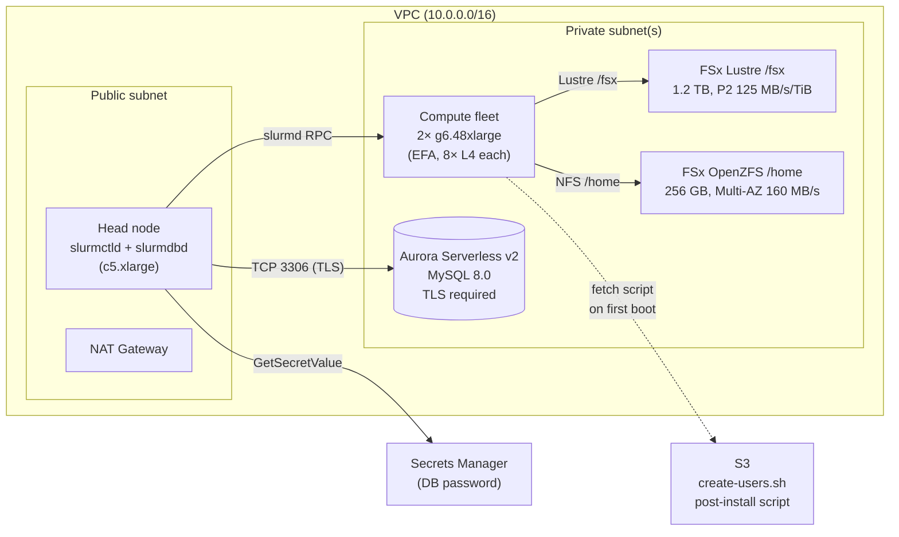

A shared GPU cluster without enforcement is a queue with a [tragedy of the
commons](https://en.wikipedia.org/wiki/Tragedy_of_the_commons) baked in. One
researcher launches a 64-GPU sweep at 9pm; the on-call engineer can't get a
1-GPU interactive session for debugging the next morning; a third user's
batch job — submitted a week ago and patiently waiting — keeps getting
shuffled to the back because nothing prevents the latest submissions from
front-running it. The scheduler is doing exactly what it was configured to do:
nothing about it.

Two pieces of infrastructure stand between you and that pain. First, every
user needs their *own* Linux identity on the cluster — both on the head node
where they submit work and on every compute node where their jobs actually
run — so that you can say "Alice's job" and have the scheduler agree. Second,
[Slurm](https://slurm.schedmd.com/) needs a *job accounting database* —
typically MySQL — that records every job, its resource usage, and the account
it billed against. Without per-user identity, every job is `root` and audit
is impossible; without the accounting database, you can't build the per-team
capacity reservations, per-user limits, and preemption rules that the
*Quality of Service (QoS)* layer needs to actually enforce policy.

This post is the first of a two-part series for **AWS ParallelCluster**
administrators operating multi-tenant GPU clusters. We'll cover the
foundation here:

1. Provisioning the accounting database using the CloudFormation template at
   [`1.architectures/8.accounting-database/`](https://github.com/awslabs/awsome-distributed-ai/tree/main/1.architectures/8.accounting-database)
   in the [awslabs/awsome-distributed-ai](https://github.com/awslabs/awsome-distributed-ai)
   repo.
2. Wiring that database into ParallelCluster via `SlurmSettings.Database`.
3. Onboarding a handful of users (alice, bob, charlie) with a **lightweight,
   no-LDAP approach**: `useradd` on the head node, plus a post-install script
   that propagates matching UIDs to every compute node via a shared FSx-OpenZFS
   file.
4. Verifying that `slurmdbd` is recording every job with the right user,
   account, and GPU TRES.

[**Part 2**](../slurm-qos-on-parallelcluster/) takes the cluster we build
here and adds QoS on top — associations, limits (`GrpTRES`, `MaxWall`),
multifactor priority and fairshare, preemption, partition QoS — realizing
a concrete shared-GPU policy: *"A research team gets a 50% capacity
reservation. Interactive jobs are capped at 1 hour and 4 GPUs per user.
Low-priority batch jobs are preemptible by both."*

By the end of this post you'll have a working ParallelCluster with three
users, an Aurora-backed accounting database, and every job ending up in
`sacct` with correct attribution. Part 2 picks up exactly there.

> **Audience**: cluster administrators. We assume comfort with `sbatch`,
> `squeue`, basic VPC and IAM, and CloudFormation. We do *not* assume any
> prior Slurm-accounting experience.

## Why an external accounting database?

Slurm without `slurmdbd` will happily run jobs, scheduling them with the
[multifactor priority plugin](https://slurm.schedmd.com/priority_multifactor.html)
or any plugin you point it at. What it *won't* do is enforce per-account or
per-user limits in any persistent way, because those limits live in
associations — *(cluster, account, user, partition)* tuples — that are kept
in the accounting database. From [the Slurm docs](https://slurm.schedmd.com/accounting.html):

> Slurm Workload Manager can be configured to collect accounting information
> for every job and job step executed […]. Accounting records can be written
> to a simple text file or a database […]. Storing information directly into
> a database can offer many benefits, including a much faster turnaround
> time for analyzing complex queries from administrators.

The "store to a flat file" mode (`jobcomp/filetxt`, used as a default in
several AWS sample configurations including
[`cluster-vanilla.yaml`](https://github.com/awslabs/awsome-distributed-ai/blob/main/1.architectures/2.aws-parallelcluster/cluster-templates/cluster-vanilla.yaml#L42))
is fine for "what jobs ran when" forensics, but it cannot back QoS — QoS
requires the relational schema that `slurmdbd` lays out on top of MySQL or
MariaDB. So the *first* thing we need is a managed MySQL.

On AWS, the natural place to land that is **Aurora Serverless v2 (MySQL
8.0)** — it scales down to fractional ACU when idle (`slurmdbd` is bursty),
encrypts at rest, requires TLS, and is fully managed. The repo provides a
[CloudFormation template](https://github.com/awslabs/awsome-distributed-ai/blob/main/1.architectures/8.accounting-database/cf_database-accounting.yaml)
that deploys exactly this, with the security-group plumbing already worked
out.

## Architecture

The full picture has four data planes:



A few details worth flagging up front:

- **`slurmctld` and `slurmdbd` both live on the head node.** This is the
  ParallelCluster default; for very large clusters you can split `slurmdbd`
  onto its own host, but that's out of scope here.
- **Aurora sits in private subnets only.** The CloudFormation template
  enforces `PubliclyAccessible: false` and `StorageEncrypted: true`, and the
  cluster parameter group sets `require_secure_transport: ON` — so any
  client connection must be over TLS. ParallelCluster handles this for you;
  hand-rolled `slurmdbd.conf` would need `StorageParameters=SSL_CA=...`.
- **Two security groups, not one.** The template emits a *server* SG
  (attached to Aurora, accepts inbound only from the *client* SG) and a
  *client* SG (which you attach to the head node). This means the head node
  can reach the DB, and nothing else in the VPC can — including the compute
  fleet, which has no business talking to `slurmdbd` directly.
- **The cluster fleet only ever talks to `slurmctld`** on the head node, via
  Slurm's own RPC. The DB is never on the compute path.

The prereqs template provisions **two private subnets** in different
AZs (specified by `PrimarySubnetAZ` and `SecondarySubnetAZ`), which the
accounting-DB template will consume directly for the Aurora
`DBSubnetGroup`. The same two subnets also back the Multi-AZ FSx OpenZFS
file system that serves `/home`, with the HA pair split across them for
cross-AZ failover.

## Provision the foundation

We'll build this in two CloudFormation layers plus one S3 bucket:

1. **Prereqs**: VPC with two private subnets in different AZs, NAT, security
   groups, FSx Lustre (`/fsx`), FSx OpenZFS Multi-AZ (`/home`)
2. **Accounting DB**: Aurora Serverless v2 + secret + client/server SGs,
   consuming both subnets from the prereqs stack
3. **S3 bucket**: home for the `create-users.sh` post-install script
4. **ParallelCluster**: head node + a single GPU queue, wired to the DB

### Pin the AWS environment

Every command in this post assumes you've pinned the profile and region for
the duration of the session. Pick once, verify, never `unset` mid-run:

```bash
export AWS_PROFILE=<your-profile>
export AWS_REGION=us-east-1
aws sts get-caller-identity   # confirm account before any deploy
```

We'll use `us-east-1` throughout because `g6.48xlarge` is broadly available
there, and the region has six AZs to pick from when capacity is tight in
your preferred AZ.

### Step 1 — Prereqs stack

The repo's
[`parallelcluster-prerequisites.yaml`](https://github.com/awslabs/awsome-distributed-ai/blob/main/1.architectures/2.aws-parallelcluster/infra-templates/parallelcluster-prerequisites.yaml)
emits everything we need: a VPC with `10.0.0.0/16` (public) and
`10.1.0.0/16` (private) CIDR ranges, **two private subnets in different
AZs** (`10.1.0.0/17` and `10.1.128.0/17`), an Internet Gateway, a NAT
Gateway, an S3 VPC endpoint, an EFA-friendly all-to-all security group,
plus FSx Lustre (for `/fsx`) and **Multi-AZ FSx OpenZFS** (for `/home`).
The Multi-AZ default means the template works in every region per the
[FSx OpenZFS availability table](https://docs.aws.amazon.com/fsx/latest/OpenZFSGuide/available-aws-regions.html),
including the regions where `SINGLE_AZ_HA_1` / `HA_2` aren't offered.

One parameter note worth calling out:

- `PerUnitStorageThroughput` (FSx Lustre) defaults to **250 MB/s/TiB**,
  which is fine for real training but doubles the per-GB-month cost over
  the **125 MB/s/TiB** minimum tier. For a QoS-walkthrough cluster we
  don't need the throughput, so we knock it down.

The template's `HomeThroughput` default is already **160 MB/s** (the
minimum valid throughput for Multi-AZ FSx OpenZFS) and has an
`AllowedValues` constraint, so misconfigurations fail at CFN parameter-
validation time instead of mid-stack inside the FSx API. The
`SecondarySubnetAZ` parameter also defaults sensibly: empty means
"auto-pick the second AZ in this region," and you can override with an
explicit AZ name if you need fine-grained control.

These knobs cut storage cost from the un-tuned default to ~$0.55/hr.

```bash
aws cloudformation create-stack \
  --stack-name slurm-qos-demo-prereqs \
  --template-body file://1.architectures/2.aws-parallelcluster/infra-templates/parallelcluster-prerequisites.yaml \
  --parameters \
    ParameterKey=VPCName,ParameterValue=slurm-qos-demo \
    ParameterKey=PrimarySubnetAZ,ParameterValue=us-east-1b \
    ParameterKey=SecondarySubnetAZ,ParameterValue=us-east-1c \
    ParameterKey=Capacity,ParameterValue=1200 \
    ParameterKey=PerUnitStorageThroughput,ParameterValue=125 \
    ParameterKey=HomeCapacity,ParameterValue=256 \
  --capabilities CAPABILITY_IAM
```

Wait for `CREATE_COMPLETE` (~15-20 minutes; FSx Lustre is the slow part):

```bash
aws cloudformation wait stack-create-complete --stack-name slurm-qos-demo-prereqs
```

And export the outputs we'll need downstream:

```bash
PREREQS_OUTPUTS=$(aws cloudformation describe-stacks \
  --stack-name slurm-qos-demo-prereqs \
  --query 'Stacks[0].Outputs' --output json)

VPC_ID=$(echo "$PREREQS_OUTPUTS" | jq -r '.[] | select(.OutputKey=="VPC") | .OutputValue')
PRIMARY_SUBNET=$(echo "$PREREQS_OUTPUTS" | jq -r '.[] | select(.OutputKey=="PrimaryPrivateSubnet") | .OutputValue')
SECONDARY_SUBNET=$(echo "$PREREQS_OUTPUTS" | jq -r '.[] | select(.OutputKey=="SecondaryPrivateSubnet") | .OutputValue')
PUBLIC_SUBNET=$(echo "$PREREQS_OUTPUTS" | jq -r '.[] | select(.OutputKey=="PublicSubnet") | .OutputValue')
EFA_SG=$(echo "$PREREQS_OUTPUTS" | jq -r '.[] | select(.OutputKey=="SecurityGroup") | .OutputValue')
FSXL_ID=$(echo "$PREREQS_OUTPUTS" | jq -r '.[] | select(.OutputKey=="FSxLustreFilesystemId") | .OutputValue')
FSXZ_VOL_ID=$(echo "$PREREQS_OUTPUTS" | jq -r '.[] | select(.OutputKey=="FSxORootVolumeId") | .OutputValue')
```

The `SecondaryPrivateSubnet` output is what makes the next step clean —
the Aurora DBSubnetGroup needs subnets in ≥2 AZs, and we now have them
without a manual `aws ec2 create-subnet` workaround.

### Step 2 — Provision the accounting DB

Now the database itself. The
[`cf_database-accounting.yaml`](https://github.com/awslabs/awsome-distributed-ai/blob/main/1.architectures/8.accounting-database/cf_database-accounting.yaml)
template exposes `EngineVersion` as a parameter, defaulting to the latest
Aurora MySQL 8.0 version available at the time of the template's last
update. Override if needed (`aws rds describe-db-engine-versions --engine
aurora-mysql --query 'DBEngineVersions[?Status==\`available\`].EngineVersion'`
lists what's live in your region).

```bash
aws cloudformation create-stack \
  --stack-name slurm-qos-demo-accounting \
  --template-body file://1.architectures/8.accounting-database/cf_database-accounting.yaml \
  --parameters \
    ParameterKey=ClusterName,ParameterValue=slurm-qos-demo-accounting \
    ParameterKey=MinCapacity,ParameterValue=1 \
    ParameterKey=MaxCapacity,ParameterValue=4 \
    ParameterKey=VpcId,ParameterValue="$VPC_ID" \
    ParameterKey=SubnetIds,ParameterValue="\"$PRIMARY_SUBNET,$SECONDARY_SUBNET\"" \
  --capabilities CAPABILITY_IAM CAPABILITY_NAMED_IAM CAPABILITY_AUTO_EXPAND
aws cloudformation wait stack-create-complete --stack-name slurm-qos-demo-accounting
```

Capture the outputs ParallelCluster will need:

```bash
DB_OUTPUTS=$(aws cloudformation describe-stacks \
  --stack-name slurm-qos-demo-accounting \
  --query 'Stacks[0].Outputs' --output json)

DB_HOST=$(echo "$DB_OUTPUTS" | jq -r '.[] | select(.OutputKey=="DatabaseHost") | .OutputValue')
DB_USER=$(echo "$DB_OUTPUTS" | jq -r '.[] | select(.OutputKey=="DatabaseAdminUser") | .OutputValue')
DB_SECRET=$(echo "$DB_OUTPUTS" | jq -r '.[] | select(.OutputKey=="DatabaseSecretArn") | .OutputValue')
DB_CLIENT_SG=$(echo "$DB_OUTPUTS" | jq -r '.[] | select(.OutputKey=="DatabaseClientSecurityGroup") | .OutputValue')

echo "Connect head node to DB via SG: $DB_CLIENT_SG"
```

`DB_CLIENT_SG` is the critical handle: it's the security group whose only
permission is to reach the Aurora cluster on TCP 3306. Anything you attach
that SG to becomes a permitted DB client. The head node gets it; nothing
else needs to.

### Step 3 — S3 bucket for the post-install script

ParallelCluster runs `CustomActions.OnNodeConfigured` on every compute node
after it boots, fetching the script from S3. We need a bucket for that:

```bash
S3_BUCKET="adt-slurm-qos-demo-$(aws sts get-caller-identity --query Account --output text)-$AWS_REGION"
aws s3 mb "s3://$S3_BUCKET"
```

The script itself is short and exactly what the
[OpenLDAP-alternative AWS blog](https://aws.amazon.com/blogs/opensource/managing-aws-parallelcluster-ssh-users-with-openldap/)
recommends — it reads `/home/shared/userlistfile` (a CSV of `username,uid` lines
that the head node maintains) and `useradd`s each entry on the compute node:

```bash
cat > create-users.sh <<'EOF'
#!/bin/bash
. "/etc/parallelcluster/cfnconfig"

IFS=","

if [ "${cfn_node_type}" = "ComputeFleet" ]; then
    while read USERNAME USERID
    do
        # -M do not create home since head node is exporting /homes via NFS
        # -u to set UID to match what is set on the head node
        if ! [ $(id -u $USERNAME 2>/dev/null || echo -1) -ge 0 ]; then
            useradd -M -u $USERID $USERNAME
        fi
    done < "/home/shared/userlistfile"
fi
EOF
chmod +x create-users.sh
aws s3 cp create-users.sh "s3://$S3_BUCKET/"
```

We'll talk about *why* this script exists (and the LDAP alternative) in the
multi-user section below. For now it's just sitting in the bucket waiting
for the compute fleet to fetch it.

### Step 4 — ParallelCluster itself

ParallelCluster 3.3+ supports Slurm accounting natively via the
[`SlurmSettings.Database`](https://docs.aws.amazon.com/parallelcluster/latest/ug/cluster-yaml-Database-section-v3.html)
block. We give it the DB host, the admin user name, and the Secrets Manager
ARN; ParallelCluster generates the `slurmdbd.conf` for us. We use
`CustomSlurmSettings` to add GPU TRES tracking (so `sreport` can tell us
who consumed how many GPU-hours):

```yaml
# slurm-qos-demo.yaml
Region: us-east-1
Imds:
  ImdsSupport: v2.0
Image:
  Os: ubuntu2204
HeadNode:
  InstanceType: c5.xlarge
  Networking:
    SubnetId: ${PUBLIC_SUBNET}
    AdditionalSecurityGroups:
      - ${EFA_SG}
      - ${DB_CLIENT_SG}              # critical: lets head node reach Aurora
  LocalStorage:
    RootVolume:
      Size: 200
      DeleteOnTermination: true
  Iam:
    AdditionalIamPolicies:
      - Policy: arn:aws:iam::aws:policy/AmazonSSMManagedInstanceCore
      - Policy: arn:aws:iam::aws:policy/AmazonS3ReadOnlyAccess
  Imds:
    Secured: false
Scheduling:
  Scheduler: slurm
  SlurmSettings:
    ScaledownIdletime: 60
    QueueUpdateStrategy: DRAIN
    Database:
      Uri: ${DB_HOST}:3306
      UserName: ${DB_USER}
      PasswordSecretArn: ${DB_SECRET}
    CustomSlurmSettings:
      - AccountingStorageTRES: gres/gpu
      - AccountingStorageEnforce: qos,limits   # otherwise QoS limits are silently inactive — see note below
      - PriorityType: priority/multifactor
      - PriorityDecayHalfLife: 7-0      # 7 days for fairshare decay
      - PriorityWeightAge: 1000
      - PriorityWeightFairshare: 100000
      - PriorityWeightQOS: 10000
      - PriorityWeightTRES: CPU=1000,Mem=2000,GRES/gpu=4000
      - PreemptType: preempt/qos
      - PreemptMode: REQUEUE
  SlurmQueues:
    - Name: gpu
      CapacityType: ONDEMAND
      Networking:
        # Single subnet matching the AZ of our on-demand capacity reservation
        # (ODCR). For an opportunistic deployment without a CR, list multiple
        # subnets across AZs so PC can fall over when one AZ is capacity-
        # constrained — but note that multi-AZ disables EFA and managed
        # placement groups (see Operational guidance below).
        SubnetIds:
          - ${SUB_1A}              # us-east-1a — same AZ as the ODCR
        AdditionalSecurityGroups:
          - ${EFA_SG}
        PlacementGroup:
          Enabled: true            # single-AZ → can use a placement group
      ComputeSettings:
        LocalStorage:
          EphemeralVolume:
            MountDir: /scratch
          RootVolume:
            Size: 200
      ComputeResources:
        - Name: g6-48xl
          # g6.48xlarge: 8× NVIDIA L4 GPUs per node; 2 nodes = 16 GPUs total.
          # Pinned to a single AZ to match an on-demand capacity reservation
          # (ODCR). The QoS scenarios below assume 8 GPUs/node.
          InstanceType: g6.48xlarge
          MinCount: 2                    # keep both nodes warm for the demo
          MaxCount: 2
          Efa:
            Enabled: true                # single-AZ → EFA OK
          CapacityReservationTarget:
            CapacityReservationId: <your-odcr-id>  # e.g. cr-0123abcd... — must be in the same AZ as Networking.SubnetIds
      CustomActions:
        OnNodeConfigured:
          Script: s3://${S3_BUCKET}/create-users.sh
      Iam:
        S3Access:
          - BucketName: ${S3_BUCKET}
SharedStorage:
  - Name: home
    MountDir: /home
    StorageType: FsxOpenZfs
    FsxOpenZfsSettings:
      VolumeId: ${FSXZ_VOL_ID}
  - Name: fsx
    MountDir: /fsx
    StorageType: FsxLustre
    FsxLustreSettings:
      FileSystemId: ${FSXL_ID}
Monitoring:
  DetailedMonitoring: false
  Logs:
    CloudWatch:
      Enabled: true
```

A few choices worth explaining:

- The **multifactor priority weights** (Age, Fairshare, QOS, TRES) are set
  to representative values, with Fairshare dominating (100,000 vs 10,000 for
  QoS). These are the *relative* magnitudes you'd typically tune for a
  research-team-vs-batch-vs-interactive cluster; we'll inspect them with
  `sprio` in the QoS section.
- **`PreemptType: preempt/qos`** turns on per-QoS preemption — the
  preemption relationship is then declared on each QoS object via
  `Preempt=<lower-qos>`. With `PreemptMode: REQUEUE`, preempted jobs go
  back into the queue rather than being killed outright.
- **`AccountingStorageTRES: gres/gpu`** is what tells `slurmdbd` to record
  GPU usage as a TRES (Trackable RESource) on every job; without it,
  `sreport` will only show CPU consumption.
- **`AccountingStorageEnforce: qos,limits`** is the line that makes QoS
  *actually enforce*. By default
  ([`slurm.conf` docs](https://slurm.schedmd.com/slurm.conf.html)) this
  setting is unset and Slurm runs "based upon policies configured in
  Slurm on each cluster" — i.e. QoS rows in `slurmdbd` are stored and
  visible but *silently inactive*. `sacctmgr` accepts QoS definitions,
  `show qos` displays them, jobs record the right QoS attribution in
  `sacct` — but every limit (`GrpTRES`, `MaxWall`, `MaxJobsPerUser`,
  `DenyOnLimit`, etc.) is ignored. Setting this to `qos,limits` is the
  minimum needed to enforce the QoS deep dive in Part 2; `limits` covers
  `GrpTRES` / `MaxWall` and `qos` covers QoS identity + flags. Both
  imply `associations`.
- The head node lands in the *public* subnet so we can `pcluster ssh` to
  it directly. The compute fleet stays in the *primary private* subnet.
- We deliberately attach **two security groups** to the head node: the EFA
  SG (so it can talk to compute nodes) and the DB client SG (so it can
  reach Aurora). This is the trick that wires everything together.

Materialize the YAML and create:

```bash
envsubst < slurm-qos-demo.yaml.tpl > slurm-qos-demo.yaml
pcluster create-cluster -n slurm-qos-demo -c slurm-qos-demo.yaml
pcluster describe-cluster -n slurm-qos-demo --query clusterStatus
# Wait for CREATE_COMPLETE (~15-20 min). Then SSH:
pcluster ssh -n slurm-qos-demo
```

ParallelCluster uses SSM Session Manager when no SSH key is configured, so
no key-pair management is required for a one-shot demo. Once you're on the
head node, sanity-check the accounting plumbing:

```bash
$ sacctmgr show cluster -P
Cluster|ControlHost|ControlPort|RPC|Share|GrpJobs|GrpTRES|GrpSubmit|MaxJobs|MaxTRES|MaxSubmit|MaxWall|QOS|Def QOS
slurm-qos-demo|10.0.47.111|6820|11264|1||||||||normal|

$ sinfo
PARTITION AVAIL  TIMELIMIT  NODES  STATE NODELIST
gpu*         up   infinite      2   idle gpu-st-g6-48xl-[1-2]

$ sacct
JobID           JobName  Partition    Account  AllocCPUS      State ExitCode
------------ ---------- ---------- ---------- ---------- ---------- --------
```

A row in `sacctmgr show cluster` (with the cluster talking to slurmctld
on port 6820), two `idle` GPU nodes in `sinfo`, and an empty `sacct`
confirms `slurmdbd` is connected, the schema is initialized, and the
cluster has registered itself with the database. We're ready to onboard
users.

## Multi-user setup without LDAP

ParallelCluster doesn't ship a user-management layer. The
[canonical solution](https://aws.amazon.com/blogs/opensource/managing-aws-parallelcluster-ssh-users-with-openldap/)
is to stand up an OpenLDAP server and join the cluster to it; that gives you
real directory services, centralized password rotation, and group
management. It's also a lot of moving parts for a small team.

The shortcut — the one we use here — is to maintain users on the **head node**
as the source of truth, and run a tiny post-install script on every compute
node that mirrors the head node's UID database. There's no central
authentication; SSH access is via key pairs, and Slurm enforces association
limits using these accounts as identifiers. It scales to dozens of users on
a small cluster, and it has the great virtue of being something you can read
in 20 lines of bash.

> **Don't use this for production.** Users share the same permissions
> bucket (no group-based authorization, no centralized password rotation,
> no audit log), and adding a user requires manually editing
> `/home/shared/userlistfile` then bouncing the compute fleet. For real
> multi-tenancy, the [OpenLDAP blog](https://aws.amazon.com/blogs/opensource/managing-aws-parallelcluster-ssh-users-with-openldap/)
> remains the right starting point.

### Step 1 — Create the users on the head node

After `pcluster ssh -n slurm-qos-demo`, become root and provision three test
users:

```bash
sudo su -

for U in alice bob charlie; do
  useradd -m -s /bin/bash "$U"
  passwd -l "$U"                       # no password — SSH-key only
  mkdir -p "/home/$U/.ssh"
  ssh-keygen -t rsa -f "/home/$U/.ssh/id_rsa" -q -N ""
  cat "/home/$U/.ssh/id_rsa.pub" > "/home/$U/.ssh/authorized_keys"
  chown -R "$U:$U" "/home/$U/.ssh"
  chmod 700 "/home/$U/.ssh"
  chmod 600 "/home/$U/.ssh/"*
done
```

This is straight out of the user's
[ParallelCluster cookbook](https://aws.amazon.com/blogs/opensource/managing-aws-parallelcluster-ssh-users-with-openldap/)
— `useradd -m` to create a home directory (which lands on the shared FSx
OpenZFS `/home` because of how we mounted it in the cluster YAML), and a
key pair per user so they can SSH between nodes for MPI launches.

### Step 2 — Publish the UID list to compute nodes

The compute fleet doesn't share `/etc/passwd` with the head node. Slurm
needs the same UID on both sides — otherwise file ownership mismatches and
job submissions silently fail. We solve this with a shared CSV file in
the FSx OpenZFS `/home` mount, which both the head node and every compute
node have read access to. Create a world-writable scratch dir for it
first:

```bash
# Still as root on the head node:
mkdir -p /home/shared
chmod 1777 /home/shared
rm -f /home/shared/userlistfile
for U in alice bob charlie; do
  echo "$U,$(id -u $U)" >> /home/shared/userlistfile
done
cat /home/shared/userlistfile
```
```
alice,1001
bob,1002
charlie,1003
```

(Your UIDs may differ — `useradd` picks the next available.)

### Step 3 — The post-install script

Compute nodes consult `/etc/parallelcluster/cfnconfig` on boot to learn
their role; if they're a `ComputeFleet` node, our
[`create-users.sh`](https://github.com/awslabs/awsome-distributed-ai/blob/main/1.architectures/2.aws-parallelcluster/post-install-scripts/create-users.sh)
reads the CSV and `useradd`s each entry with the matching UID:

```bash
#!/bin/bash
# Idempotent + tolerant of a missing userlistfile (normal on first boot
# before the admin has created any users on the head node).
set -uo pipefail
. "/etc/parallelcluster/cfnconfig"

[ "${cfn_node_type:-}" = "ComputeFleet" ] || exit 0

USERLIST=/home/shared/userlistfile
if [ ! -f "$USERLIST" ]; then
    echo "create-users.sh: $USERLIST not present yet — exiting 0"
    exit 0
fi

IFS=","
while read USERNAME USERID
do
    [ -z "${USERNAME:-}" ] && continue
    if ! id -u "$USERNAME" >/dev/null 2>&1; then
        # -M: don't create home (head node exports /home via FSx OpenZFS)
        # -u: pin UID so file ownership matches across the cluster
        useradd -M -u "$USERID" "$USERNAME"
    fi
done < "$USERLIST"
```

> **Critical**: make the script *tolerant of a missing userlistfile*. On the
> very first cluster boot, the compute fleet comes up *before* you've had a
> chance to SSH to the head node and create users. If `OnNodeConfigured`
> exits non-zero (e.g. a bash redirect against a non-existent file), the
> compute node bootstrap is marked failed by ParallelCluster, the instance
> self-terminates, and the cluster create hangs in
> `HeadNodeWaitCondition` until eventually timing out. The script must be
> an explicit no-op when the file is absent.

The script is referenced from the queue config in our
[`slurm-qos-demo.yaml`](https://github.com/awslabs/awsome-distributed-ai/tree/main/1.architectures/8.accounting-database#configure-aws-parallelcluster) — the exact YAML block is:

```yaml
# Under Scheduling.SlurmQueues[]
CustomActions:
  OnNodeConfigured:
    Script: s3://${S3_BUCKET}/create-users.sh
Iam:
  S3Access:
    - BucketName: ${S3_BUCKET}
```

### Step 4 — Force the compute fleet to re-run OnNodeConfigured

`OnNodeConfigured` runs once, when a compute node first comes up. The
cluster's two `g6.48xlarge` nodes booted *before* we created `/home/shared/userlistfile`,
so they don't know about Alice, Bob, or Charlie yet. Force a recycle:

```bash
# From your laptop:
pcluster update-compute-fleet -n slurm-qos-demo --status STOP_REQUESTED
# Wait for fleet to drain (~30 s), then:
pcluster update-compute-fleet -n slurm-qos-demo --status START_REQUESTED
```

Once the nodes are back, verify the users exist on a compute node by
launching a one-shot job that just runs `id`:

```bash
$ srun -p gpu -N1 -n1 /bin/bash -c "id alice && id bob && id charlie"
uid=1001(alice) gid=1001(alice) groups=1001(alice)
uid=1002(bob) gid=1002(bob) groups=1002(bob)
uid=1003(charlie) gid=1003(charlie) groups=1003(charlie)
```

The same UIDs on both sides of the cluster is the *whole point* of this
exercise; without it, `srun --uid alice` from the head node would land on a
compute node where `alice` doesn't exist and Slurm would either reject the
launch or run as a different user with confusing ownership.

## Accounting basics — verify it works

With users created and a working database backend, every job Slurm runs
now ends up in `slurmdbd`. A quick smoke test:

```bash
sudo -u alice sbatch <<'EOF'
#!/bin/bash
#SBATCH --job-name=accounting-smoke
#SBATCH --partition=gpu
#SBATCH --gres=gpu:1
#SBATCH --time=00:02:00
echo "Hello from $(hostname) at $(date)"
nvidia-smi -L
sleep 30
EOF
```

After it completes (about 90 s later — most of that is node-ready time):

```bash
$ sacct -a -u alice --format=JobID,User,Account,Partition,AllocTRES%40,Elapsed,State
JobID             User    Account  Partition                                AllocTRES    Elapsed      State
------------ --------- ---------- ---------- ---------------------------------------- ---------- ----------
1                alice                   gpu        billing=1,cpu=1,gres/gpu=1,node=1   00:00:30  COMPLETED
1.batch                                                 cpu=1,gres/gpu=1,mem=0,node=1   00:00:30  COMPLETED
```

Note three things:

1. **AllocTRES contains `gres/gpu=1`** — because we set
   `AccountingStorageTRES: gres/gpu` in the cluster YAML. The L4 GPU on
   the g6.48xlarge was correctly tracked as a TRES.
2. **Account is empty** — Alice doesn't yet have a Slurm account
   association, so the job billed against the default `normal` association
   (you can see this by adding the `-o ...,QOS%14` column: it'll show
   `normal`). The next section, `sacctmgr add user`, fixes this.
3. **Elapsed time is in `slurmdbd`** — the `sreport` tool can now aggregate
   GPU-hours per user, per account, or per QoS once we configure those:

   ```bash
   $ sreport cluster Utilization start=$(date -u +%Y-%m-%dT00:00:00)
   --------------------------------------------------------------------------------
   Cluster Utilization 2026-05-16T00:00:00 - 2026-05-16T13:21:00 (47000 secs)
   Usage reported in CPU Minutes
   --------------------------------------------------------------------------------
     Cluster Allocate     Down PLND Dow     Idle  Planned Reported
   --------- -------- -------- -------- -------- -------- --------
   slurm-q+        1        0        0    25023      144    25168
   ```

   (Most cluster time is `Idle` because we only ran a 30-second smoke job
   so far. After the QoS scenario below, those numbers shift toward
   `Allocate`.)

## Operational guidance

The walkthrough above is the happy path. Here are the gotchas that bite
in production:

| Gotcha | Symptom | Mitigation |
|---|---|---|
| `slurmdbd` not running when `slurmctld` starts | Cluster boots, every `sacctmgr` command returns `Could not contact accounting storage` | PC handles this on create. For manual edits, restart `slurmdbd` first, *then* `slurmctld`. |
| Secret rotation | `slurmdbd` keeps using the cached password from cluster-create time | A `pcluster update-cluster` re-reads the secret; plain Secrets Manager rotations don't propagate automatically. |
| Setting `AccountingStorageTRES` after jobs have run | GPU TRES doesn't backfill onto old jobs | Set it in the PC YAML *before* the cluster ever runs a real job. |
| `InsufficientInstanceCapacity` for the target instance type in your chosen AZ | Cluster create fails with chef stuck on `Waiting for static fleet capacity provisioning`, then a `WaitCondition timed out` from CloudFormation | AWS surfaces the working AZs in the error message ("You can currently get capacity by [...] choosing us-east-1c, us-east-1d, us-east-1f"). Secure capacity in a known AZ via an [On-Demand Capacity Reservation](https://docs.aws.amazon.com/AWSEC2/latest/UserGuide/ec2-capacity-reservations.html) or [EC2 Capacity Block for ML](https://docs.aws.amazon.com/AWSEC2/latest/UserGuide/ec2-capacity-blocks.html), then point `Networking.SubnetIds` at the matching AZ's subnet. |
| `OnNodeConfigured` script fails on first boot → compute self-terminates → `HeadNodeWaitCondition timed out` | Cluster CREATE never finishes; failed-bootstrap counter on `clustermgtd.events` keeps incrementing | Author every `OnNodeConfigured` script to be **idempotent and tolerant of missing inputs**. In our walkthrough the script reads `/home/shared/userlistfile`, which doesn't exist on the very first boot (the head node hasn't gotten there yet). An unconditional `< /home/shared/userlistfile` bash redirect on a non-existent file exits non-zero, and PC interprets that as bootstrap failure. The fixed script checks `[ -f $USERLIST ] || exit 0` before reading. |
| Aurora ACU floor charges 24/7 | Even an idle cluster bills ~$0.12/hr from Aurora | Acceptable; if you tear the cluster down nightly, also delete the DB stack. |
| `require_secure_transport: ON` rejects plaintext clients | Manual `mysql` clients connecting directly fail with `SSL connection error` | Use `mysql --ssl-mode=REQUIRED --ssl-ca=/path/to/global-bundle.pem`, or connect via `slurmdbd` only. |
| `sbatch` from a non-shared cwd → job dies with `ExitCode 0:53`, looks like a QoS denial | `slurmd.log` shows `_init_task_stdio_fds: Could not open stdout file '...' No such file` followed by `_fork_all_tasks: IO setup failed: Slurmd could not connect IO`; `sacct` reports `FAILED 0:53` with no useful Reason — indistinguishable from a `DenyOnLimit` denial | `sbatch`'s default `--output` is `slurm-%j.out` in the *invocation* cwd (per the [sbatch docs](https://slurm.schedmd.com/sbatch.html)). When `sbatch` is invoked from automation — `aws ssm send-command` (cwd is `/var/snap/amazon-ssm-agent/<pid>/`), a `cron` job, a `systemd` unit — that path doesn't exist on the compute node, slurmd can't create it, and the job dies with signal 53 before the prolog runs. Pass `--chdir=/home/$USER` *or* `--output=/fsx/slurm-%j.out` to anchor the output path explicitly. |

Drafting this post surfaced five upstream changes in
[`awslabs/awsome-distributed-ai`](https://github.com/awslabs/awsome-distributed-ai)
— three already merged, two still in flight at the time of writing:

| Issue | PR | Status | What it fixes |
|---|---|---|---|
| [#1094](https://github.com/awslabs/awsome-distributed-ai/issues/1094) | [#1098](https://github.com/awslabs/awsome-distributed-ai/pull/1098) | merged | Three typos and a leftover LDAP copy/paste line in the accounting-DB README (`custeradmin` → `clusteradmin`, `slurmdctld` → `slurmctld`, "LDAP User Interface" → "database"). |
| [#1095](https://github.com/awslabs/awsome-distributed-ai/issues/1095) | [#1099](https://github.com/awslabs/awsome-distributed-ai/pull/1099) | in flight | The HyperPod `slurmdbd.conf` snippet doesn't configure TLS even though the Aurora cluster parameter group sets `require_secure_transport: ON`. Adds the RDS CA bundle download and `StorageParameters=SSL_CA=...`. ParallelCluster is unaffected — PC plumbs SSL automatically. |
| [#1096](https://github.com/awslabs/awsome-distributed-ai/issues/1096) | [#1101](https://github.com/awslabs/awsome-distributed-ai/pull/1101) | merged | Accounting-DB template pinned the retired Aurora MySQL `8.0.mysql_aurora.3.07.1`. Exposes `EngineVersion` as a parameter (default `8.0.mysql_aurora.3.12.0`) so future Aurora rotations don't break the template. |
| [#1097](https://github.com/awslabs/awsome-distributed-ai/issues/1097) | [#1100](https://github.com/awslabs/awsome-distributed-ai/pull/1100) | merged | Tactical fix for the prereqs template hard-coding `SINGLE_AZ_HA_1` for FSx OpenZFS (unavailable in us-east-1 and other major regions). Flipped the default to `SINGLE_AZ_HA_2`. |
| — | [#1102](https://github.com/awslabs/awsome-distributed-ai/pull/1102) | in flight | Follow-up to #1100 that also addresses the manual-second-subnet workaround. Adds a `SecondarySubnetAZ` parameter and a second private subnet, then switches FSx OpenZFS from `SINGLE_AZ_HA_2` to `MULTI_AZ_1` — the only deployment type with universal regional coverage. This walkthrough assumes #1102 has merged; readers running it before then will see the template still on `SINGLE_AZ_HA_2` and need to add a second subnet by hand. |

## Wrap-up — and what's next

We've taken a stock ParallelCluster deployment and added two things every
multi-tenant cluster needs: an **Aurora-backed Slurm accounting database**
where every job lands in `slurmdbd` with full attribution, and a
**lightweight multi-user identity layer** where `alice`, `bob`, and
`charlie` share consistent UIDs across the head node and every compute
node — no LDAP, no IDP, just a CSV file on FSx OpenZFS and a small
post-install script.

The building blocks:

- The [`1.architectures/8.accounting-database/`](https://github.com/awslabs/awsome-distributed-ai/tree/main/1.architectures/8.accounting-database)
  CloudFormation template gives you the Aurora cluster + secret + SGs
  needed for `slurmdbd`.
- The
  [`1.architectures/2.aws-parallelcluster/infra-templates/parallelcluster-prerequisites.yaml`](https://github.com/awslabs/awsome-distributed-ai/blob/main/1.architectures/2.aws-parallelcluster/infra-templates/parallelcluster-prerequisites.yaml)
  prereqs template handles VPC + two private subnets + FSx Lustre + Multi-AZ FSx OpenZFS.
- ParallelCluster ≥3.3's
  [`SlurmSettings.Database`](https://docs.aws.amazon.com/parallelcluster/latest/ug/cluster-yaml-Database-section-v3.html)
  field wires `slurmdbd` in automatically (and plumbs the RDS CA so TLS
  "just works").
- A two-step user pattern — `useradd` on the head node, plus a shared
  `userlistfile` on FSx OpenZFS that a post-install script reads on every
  compute node — gives consistent UIDs without an external identity store.

Right now every job correctly attributes to a user, but nothing actually
*enforces* fair sharing. Alice can still grab all 16 GPUs for 72 hours and
starve everyone else. The `normal` QoS that every job billed against in
the smoke test is a placeholder — no priority differentiation, no per-team
caps, no preemption.

### Up next — Part 2

[**Part 2 — Slurm QoS Deep Dive**](../slurm-qos-on-parallelcluster/) takes
the cluster you've built here and adds the policy layer:

- **Associations** — bind users to billing accounts so QoS limits have a
  target to gate against.
- **QoS limits** — `MaxWall`, `GrpTRES`, `MaxJobsPerUser` and how each
  knob actually rejects (or pends) a job.
- **Multifactor priority and fairshare** — the formula behind every
  pending-job ordering, and how `sshare`/`sprio` let you debug it.
- **Preemption** — declarative "QoS A can preempt QoS B" rules, demonstrated
  with a `research` job requeuing a `batch-lowprio` one.
- **Partition QoS, job arrays, and the assembled multi-tenant scenario.**

By the end you'll have realized the policy:

> *"A research team gets a 50% capacity reservation. Interactive jobs are
> capped at 1 hour and 4 GPUs per user. Low-priority batch jobs are
> preemptible by both."*

— with `sacctmgr`, `sshare`, `sprio`, `squeue`, and `sacct` all telling
the same story, on the cluster you just provisioned.

### Further reading

- [Slurm Accounting](https://slurm.schedmd.com/accounting.html) — the
  upstream reference
- [Managing AWS ParallelCluster SSH Users with OpenLDAP](https://aws.amazon.com/blogs/opensource/managing-aws-parallelcluster-ssh-users-with-openldap/)
  — the production-grade alternative to the lightweight method shown above
- [ParallelCluster `SlurmSettings.Database`](https://docs.aws.amazon.com/parallelcluster/latest/ug/cluster-yaml-Database-section-v3.html)
  — the canonical reference for the wiring done in Step 5
- [Aurora Serverless v2 docs](https://docs.aws.amazon.com/AmazonRDS/latest/AuroraUserGuide/aurora-serverless-v2.html)
  — sizing and operational guidance for the DB
