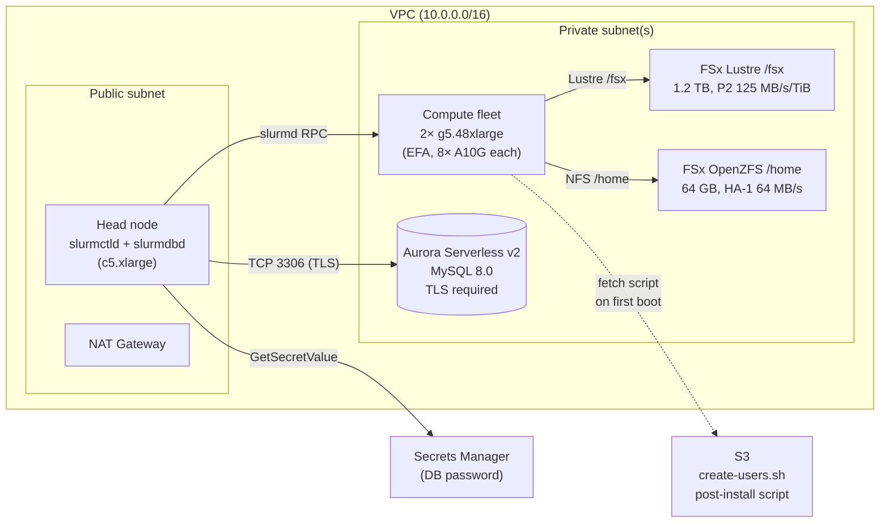
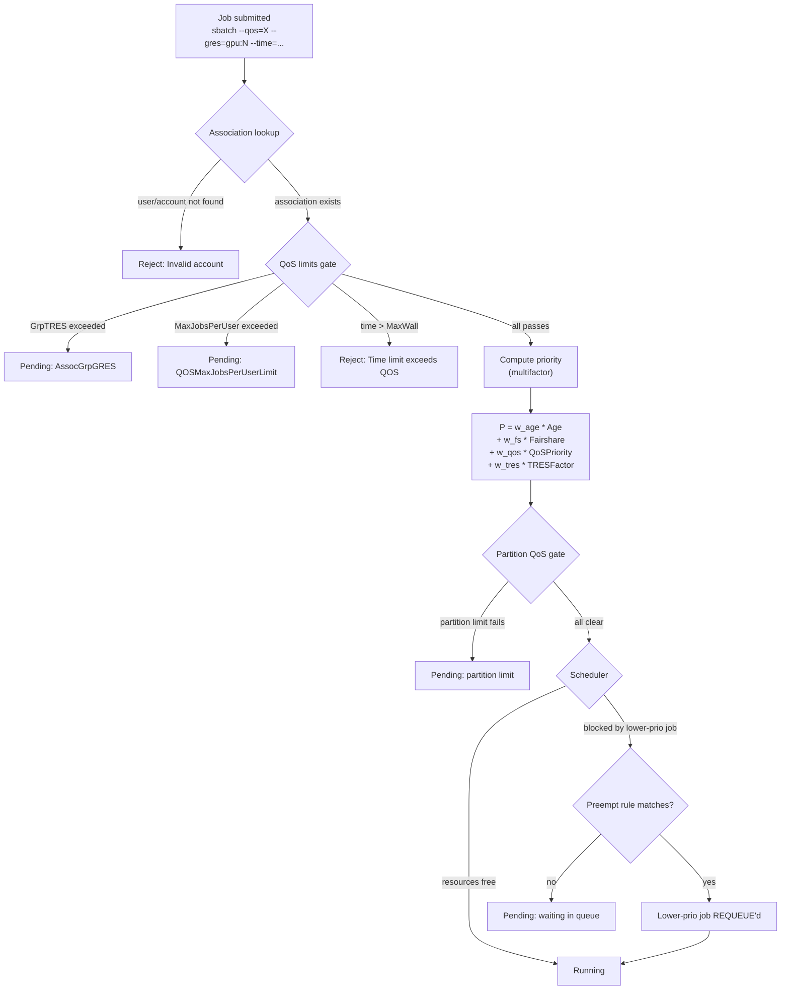

A shared GPU cluster without enforcement is a queue with a [tragedy of the
commons](https://en.wikipedia.org/wiki/Tragedy_of_the_commons) baked in. One
researcher launches a 64-GPU sweep at 9pm; the on-call engineer can't get a
1-GPU interactive session for debugging the next morning; a third user's
batch job — submitted a week ago and patiently waiting — keeps getting
shuffled to the back because nothing prevents the latest submissions from
front-running it. The scheduler is doing exactly what it was configured to do:
nothing about it.

[Slurm](https://slurm.schedmd.com/) ships the machinery to fix this — but it
requires two pieces of infrastructure that, on AWS, you have to assemble
yourself. First, a *job accounting database* — typically MySQL — that records
every job, its resource usage, and the account it billed against. Second, a
*Quality of Service (QoS)* layer that uses that account information to enforce
per-team capacity reservations, per-user limits, and preemption rules. Without
the database, QoS has no associations to gate against; without QoS, the
database is a passive log of how badly your cluster got over-subscribed.

This post is a deep dive on both, for **AWS ParallelCluster** administrators
operating multi-tenant GPU clusters. We'll provision the accounting database
using the CloudFormation template at
[`1.architectures/8.accounting-database/`](https://github.com/awslabs/awsome-distributed-ai/tree/main/1.architectures/8.accounting-database)
in the [awslabs/awsome-distributed-ai](https://github.com/awslabs/awsome-distributed-ai)
repo, wire it into ParallelCluster, onboard a handful of users with a
lightweight (no-LDAP) approach, and then drive a complete QoS configuration
realizing a concrete multi-tenant policy:

> *"A research team gets a 50% capacity reservation. Interactive jobs are
> capped at 1 hour and 4 GPUs per user. Low-priority batch jobs are
> preemptible by both."*

By the end you'll have a cluster where `sacctmgr`, `sshare`, and `sprio` all
have something to say, and you'll understand what each of them is saying.

> **Audience**: cluster administrators. We assume comfort with `sbatch`,
> `squeue`, basic VPC and IAM, and CloudFormation. We do *not* assume any
> prior Slurm-accounting or QoS experience.

## Why an external accounting database?

Slurm without `slurmdbd` will happily run jobs, scheduling them with the
[multifactor priority plugin](https://slurm.schedmd.com/priority_multifactor.html)
or any plugin you point it at. What it *won't* do is enforce per-account or
per-user limits in any persistent way, because those limits live in
associations — *(cluster, account, user, partition)* tuples — that are kept
in the accounting database. From [the Slurm docs](https://slurm.schedmd.com/accounting.html):

> Slurm Workload Manager can be configured to collect accounting information
> for every job and job step executed […]. Accounting records can be written
> to a simple text file or a database […]. Storing information directly into
> a database can offer many benefits, including a much faster turnaround
> time for analyzing complex queries from administrators.

The "store to a flat file" mode (`jobcomp/filetxt`, used as a default in
several AWS sample configurations including
[`cluster-vanilla.yaml`](https://github.com/awslabs/awsome-distributed-ai/blob/main/1.architectures/2.aws-parallelcluster/cluster-templates/cluster-vanilla.yaml#L42))
is fine for "what jobs ran when" forensics, but it cannot back QoS — QoS
requires the relational schema that `slurmdbd` lays out on top of MySQL or
MariaDB. So the *first* thing we need is a managed MySQL.

On AWS, the natural place to land that is **Aurora Serverless v2 (MySQL
8.0)** — it scales down to fractional ACU when idle (`slurmdbd` is bursty),
encrypts at rest, requires TLS, and is fully managed. The repo provides a
[CloudFormation template](https://github.com/awslabs/awsome-distributed-ai/blob/main/1.architectures/8.accounting-database/cf_database-accounting.yaml)
that deploys exactly this, with the security-group plumbing already worked
out.

## Architecture

The full picture has four data planes:



A few details worth flagging up front:

- **`slurmctld` and `slurmdbd` both live on the head node.** This is the
  ParallelCluster default; for very large clusters you can split `slurmdbd`
  onto its own host, but that's out of scope here.
- **Aurora sits in private subnets only.** The CloudFormation template
  enforces `PubliclyAccessible: false` and `StorageEncrypted: true`, and the
  cluster parameter group sets `require_secure_transport: ON` — so any
  client connection must be over TLS. ParallelCluster handles this for you;
  hand-rolled `slurmdbd.conf` would need `StorageParameters=SSL_CA=...`.
- **Two security groups, not one.** The template emits a *server* SG
  (attached to Aurora, accepts inbound only from the *client* SG) and a
  *client* SG (which you attach to the head node). This means the head node
  can reach the DB, and nothing else in the VPC can — including the compute
  fleet, which has no business talking to `slurmdbd` directly.
- **The cluster fleet only ever talks to `slurmctld`** on the head node, via
  Slurm's own RPC. The DB is never on the compute path.

There's one wrinkle the source template doesn't currently document: Aurora's
`DBSubnetGroup` requires subnets in **at least two different availability
zones**, but the repo's
[`parallelcluster-prerequisites.yaml`](https://github.com/awslabs/awsome-distributed-ai/blob/main/1.architectures/2.aws-parallelcluster/infra-templates/parallelcluster-prerequisites.yaml)
creates exactly one private subnet, in a single AZ specified by the
`PrimarySubnetAZ` parameter. We'll work around that with one extra
`aws ec2 create-subnet` call below.

## Provision the foundation

We're going to build this in three CloudFormation layers plus one S3 bucket:

1. **Prereqs**: VPC, NAT, security groups, FSx Lustre, FSx OpenZFS
2. **Manual fix**: a second private subnet in a different AZ (for Aurora)
3. **Accounting DB**: Aurora Serverless v2 + secret + client/server SGs
4. **S3 bucket**: home for the `create-users.sh` post-install script
5. **ParallelCluster**: head node + a single GPU queue, wired to the DB

### Pin the AWS environment

Every command in this post assumes you've pinned the profile and region for
the duration of the session. Pick once, verify, never `unset` mid-run:

```bash
export AWS_PROFILE=<your-profile>
export AWS_REGION=us-east-1
aws sts get-caller-identity   # confirm account before any deploy
```

We'll use `us-east-1` throughout because `g5.48xlarge` is available in five
of its AZs (`1a`, `1b`, `1c`, `1d`, `1f`), which gives us plenty of room to
land the cluster and pick a second AZ for the DB.

> **AZ caveat for FSx OpenZFS** — at the time of writing, the prereqs
> template uses `DeploymentType: SINGLE_AZ_HA_1` for `/home`. HA_1 depends
> on first-generation FSx hardware that has been rolling off in favor of
> [`SINGLE_AZ_HA_2`](https://docs.aws.amazon.com/fsx/latest/OpenZFSGuide/deployment-options.html)
> (Graviton-based, broader AZ coverage). In our test deployments, `HA_1`
> failed in both `us-east-1a` and `us-east-1b` with:
>
> ```
> The file system creation request failed because OpenZFS file systems with
> the provided deployment type and storage type are not available in the
> requested Availability Zones
> ```
>
> For the rest of this post we use a **forked template** with HA_1 changed
> to HA_2 — a single-line patch:
>
> ```bash
> sed 's/DeploymentType: SINGLE_AZ_HA_1/DeploymentType: SINGLE_AZ_HA_2/' \
>   1.architectures/2.aws-parallelcluster/infra-templates/parallelcluster-prerequisites.yaml \
>   > parallelcluster-prerequisites-ha2.yaml
> ```
>
> HA_2 has different parameter minimums: **storage ≥256 GiB** and
> **throughput ≥160 MB/s** (HA_1 allowed 64/128). Reflect this in the
> create-stack parameters below. The pricing per MB/s is also different;
> see the [FSx OpenZFS pricing page](https://aws.amazon.com/fsx/openzfs/pricing/).

### Step 1 — Prereqs stack

The repo's
[`parallelcluster-prerequisites.yaml`](https://github.com/awslabs/awsome-distributed-ai/blob/main/1.architectures/2.aws-parallelcluster/infra-templates/parallelcluster-prerequisites.yaml)
emits everything we need: a VPC with `10.0.0.0/16` (public) and `10.1.0.0/16`
(private) CIDR ranges, an Internet Gateway, a NAT Gateway, an S3 VPC
endpoint, an EFA-friendly all-to-all security group, plus FSx Lustre (for
`/fsx`) and FSx OpenZFS (for `/home`).

Two parameter notes:

- `PerUnitStorageThroughput` defaults to **250 MB/s/TiB**, which is fine for
  real training but doubles the per-GB-month cost over the **125 MB/s/TiB**
  minimum tier. For a QoS-walkthrough cluster we don't need the throughput,
  so we knock it down.
- `HomeThroughput` (the FSx OpenZFS provisioned throughput) defaults to
  **512 MB/s**. That's badly oversized for shared home directories on a
  3-user demo cluster, and FSx OpenZFS prices throughput aggressively. Drop
  it to the **128 MB/s** minimum allowed for `SINGLE_AZ_HA_1` deployments.
  (Watch for this gotcha: the `HomeThroughput` parameter has no
  `AllowedValues` constraint in the template, but FSx rejects values below
  128 with a `BadRequest` from the API rather than from CloudFormation
  itself — a failed CREATE that takes you straight to `ROLLBACK_COMPLETE`.)

These two knobs cut storage cost from ~$1.70/hr to ~$0.55/hr.

```bash
aws cloudformation create-stack \
  --stack-name slurm-qos-demo-prereqs \
  --template-body file://parallelcluster-prerequisites-ha2.yaml \
  --parameters \
    ParameterKey=VPCName,ParameterValue=slurm-qos-demo \
    ParameterKey=PrimarySubnetAZ,ParameterValue=us-east-1b \
    ParameterKey=Capacity,ParameterValue=1200 \
    ParameterKey=PerUnitStorageThroughput,ParameterValue=125 \
    ParameterKey=HomeCapacity,ParameterValue=256 \
    ParameterKey=HomeThroughput,ParameterValue=160 \
  --capabilities CAPABILITY_IAM
```

Wait for `CREATE_COMPLETE` (~15-20 minutes; FSx Lustre is the slow part):

```bash
aws cloudformation wait stack-create-complete --stack-name slurm-qos-demo-prereqs
```

And export the outputs we'll need downstream:

```bash
PREREQS_OUTPUTS=$(aws cloudformation describe-stacks \
  --stack-name slurm-qos-demo-prereqs \
  --query 'Stacks[0].Outputs' --output json)

VPC_ID=$(echo "$PREREQS_OUTPUTS" | jq -r '.[] | select(.OutputKey=="VPC") | .OutputValue')
PRIMARY_SUBNET=$(echo "$PREREQS_OUTPUTS" | jq -r '.[] | select(.OutputKey=="PrimaryPrivateSubnet") | .OutputValue')
PUBLIC_SUBNET=$(echo "$PREREQS_OUTPUTS" | jq -r '.[] | select(.OutputKey=="PublicSubnet") | .OutputValue')
EFA_SG=$(echo "$PREREQS_OUTPUTS" | jq -r '.[] | select(.OutputKey=="SecurityGroup") | .OutputValue')
FSXL_ID=$(echo "$PREREQS_OUTPUTS" | jq -r '.[] | select(.OutputKey=="FSxLustreFilesystemId") | .OutputValue')
FSXZ_VOL_ID=$(echo "$PREREQS_OUTPUTS" | jq -r '.[] | select(.OutputKey=="FSxORootVolumeId") | .OutputValue')
```

### Step 2 — Add a second private subnet

This is the part the prereqs template doesn't do for you. The Aurora
DBSubnetGroup demands AZ-redundancy, so we carve a second `/19` out of the
private CIDR block in a *different* AZ:

```bash
# Pick a second AZ that has capacity for whatever else you might want to run there.
# (Must be different from PrimarySubnetAZ, so we use 1c here since the prereqs landed in 1b.)
SECONDARY_AZ=us-east-1c

SECONDARY_SUBNET=$(aws ec2 create-subnet \
  --vpc-id "$VPC_ID" \
  --cidr-block 10.1.128.0/19 \
  --availability-zone "$SECONDARY_AZ" \
  --tag-specifications "ResourceType=subnet,Tags=[{Key=Name,Value=slurm-qos-demo Private Subnet - $SECONDARY_AZ}]" \
  --query 'Subnet.SubnetId' --output text)

echo "Secondary private subnet: $SECONDARY_SUBNET"

# Associate it with the existing private route table (NAT-routed).
PRIVATE_RT=$(aws ec2 describe-route-tables \
  --filters "Name=vpc-id,Values=$VPC_ID" "Name=route.nat-gateway-id,Values=*" \
  --query 'RouteTables[0].RouteTableId' --output text)
aws ec2 associate-route-table --subnet-id "$SECONDARY_SUBNET" --route-table-id "$PRIVATE_RT"
```

The DB doesn't actually receive cross-AZ traffic in our setup (the head node
is in the public subnet, which routes through the primary AZ's NAT gateway),
but RDS requires the *subnet group* to span ≥2 AZs whether or not Aurora
deploys an instance into both. The serverless v2 cluster we deploy below
runs one writer instance in the primary AZ; the secondary subnet's only job
is to satisfy the API.

### Step 3 — Provision the accounting DB

Now the database itself, with the prereqs subnets wired in. One patch
first: the template hard-codes an Aurora MySQL engine version
(`8.0.mysql_aurora.3.07.1` at the time of this writing) that
[AWS rotates out of service on a rolling basis](https://docs.aws.amazon.com/AmazonRDS/latest/AuroraUserGuide/AuroraMySQL.Updates.Versions.html).
If the version named in the template is no longer offered in your region,
CloudFormation fails with `Cannot find version 8.0.mysql_aurora.3.07.1 for
aurora-mysql`. Patch to a current version (`aws rds
describe-db-engine-versions --engine aurora-mysql` lists what's live):

```bash
sed 's|EngineVersion: "8.0.mysql_aurora.3.07.1"|EngineVersion: "8.0.mysql_aurora.3.09.0"|' \
  1.architectures/8.accounting-database/cf_database-accounting.yaml \
  > cf_database-accounting-patched.yaml
```

Then deploy:

```bash
aws cloudformation create-stack \
  --stack-name slurm-qos-demo-accounting \
  --template-body file://cf_database-accounting-patched.yaml \
  --parameters \
    ParameterKey=ClusterName,ParameterValue=slurm-qos-demo-accounting \
    ParameterKey=MinCapacity,ParameterValue=1 \
    ParameterKey=MaxCapacity,ParameterValue=4 \
    ParameterKey=VpcId,ParameterValue="$VPC_ID" \
    ParameterKey=SubnetIds,ParameterValue="\"$PRIMARY_SUBNET,$SECONDARY_SUBNET\"" \
  --capabilities CAPABILITY_IAM CAPABILITY_NAMED_IAM CAPABILITY_AUTO_EXPAND
aws cloudformation wait stack-create-complete --stack-name slurm-qos-demo-accounting
```

Capture the outputs ParallelCluster will need:

```bash
DB_OUTPUTS=$(aws cloudformation describe-stacks \
  --stack-name slurm-qos-demo-accounting \
  --query 'Stacks[0].Outputs' --output json)

DB_HOST=$(echo "$DB_OUTPUTS" | jq -r '.[] | select(.OutputKey=="DatabaseHost") | .OutputValue')
DB_USER=$(echo "$DB_OUTPUTS" | jq -r '.[] | select(.OutputKey=="DatabaseAdminUser") | .OutputValue')
DB_SECRET=$(echo "$DB_OUTPUTS" | jq -r '.[] | select(.OutputKey=="DatabaseSecretArn") | .OutputValue')
DB_CLIENT_SG=$(echo "$DB_OUTPUTS" | jq -r '.[] | select(.OutputKey=="DatabaseClientSecurityGroup") | .OutputValue')

echo "Connect head node to DB via SG: $DB_CLIENT_SG"
```

`DB_CLIENT_SG` is the critical handle: it's the security group whose only
permission is to reach the Aurora cluster on TCP 3306. Anything you attach
that SG to becomes a permitted DB client. The head node gets it; nothing
else needs to.

### Step 4 — S3 bucket for the post-install script

ParallelCluster runs `CustomActions.OnNodeConfigured` on every compute node
after it boots, fetching the script from S3. We need a bucket for that:

```bash
S3_BUCKET="adt-slurm-qos-demo-$(aws sts get-caller-identity --query Account --output text)-$AWS_REGION"
aws s3 mb "s3://$S3_BUCKET"
```

The script itself is short and exactly what the
[OpenLDAP-alternative AWS blog](https://aws.amazon.com/blogs/opensource/managing-aws-parallelcluster-ssh-users-with-openldap/)
recommends — it reads `/home/shared/userlistfile` (a CSV of `username,uid` lines
that the head node maintains) and `useradd`s each entry on the compute node:

```bash
cat > create-users.sh <<'EOF'
#!/bin/bash
. "/etc/parallelcluster/cfnconfig"

IFS=","

if [ "${cfn_node_type}" = "ComputeFleet" ]; then
    while read USERNAME USERID
    do
        # -M do not create home since head node is exporting /homes via NFS
        # -u to set UID to match what is set on the head node
        if ! [ $(id -u $USERNAME 2>/dev/null || echo -1) -ge 0 ]; then
            useradd -M -u $USERID $USERNAME
        fi
    done < "/home/shared/userlistfile"
fi
EOF
chmod +x create-users.sh
aws s3 cp create-users.sh "s3://$S3_BUCKET/"
```

We'll talk about *why* this script exists (and the LDAP alternative) in the
multi-user section below. For now it's just sitting in the bucket waiting
for the compute fleet to fetch it.

### Step 5 — ParallelCluster itself

ParallelCluster 3.3+ supports Slurm accounting natively via the
[`SlurmSettings.Database`](https://docs.aws.amazon.com/parallelcluster/latest/ug/cluster-yaml-Database-section-v3.html)
block. We give it the DB host, the admin user name, and the Secrets Manager
ARN; ParallelCluster generates the `slurmdbd.conf` for us. We use
`CustomSlurmSettings` to add GPU TRES tracking (so `sreport` can tell us
who consumed how many GPU-hours):

```yaml
# slurm-qos-demo.yaml
Region: us-east-1
Imds:
  ImdsSupport: v2.0
Image:
  Os: ubuntu2204
HeadNode:
  InstanceType: c5.xlarge
  Networking:
    SubnetId: ${PUBLIC_SUBNET}
    AdditionalSecurityGroups:
      - ${EFA_SG}
      - ${DB_CLIENT_SG}              # critical: lets head node reach Aurora
  LocalStorage:
    RootVolume:
      Size: 200
      DeleteOnTermination: true
  Iam:
    AdditionalIamPolicies:
      - Policy: arn:aws:iam::aws:policy/AmazonSSMManagedInstanceCore
      - Policy: arn:aws:iam::aws:policy/AmazonS3ReadOnlyAccess
  Imds:
    Secured: false
Scheduling:
  Scheduler: slurm
  SlurmSettings:
    ScaledownIdletime: 60
    QueueUpdateStrategy: DRAIN
    Database:
      Uri: ${DB_HOST}:3306
      UserName: ${DB_USER}
      PasswordSecretArn: ${DB_SECRET}
    CustomSlurmSettings:
      - AccountingStorageTRES: gres/gpu
      - PriorityType: priority/multifactor
      - PriorityDecayHalfLife: 7-0      # 7 days for fairshare decay
      - PriorityWeightAge: 1000
      - PriorityWeightFairshare: 100000
      - PriorityWeightQOS: 10000
      - PriorityWeightTRES: CPU=1000,Mem=2000,GRES/gpu=4000
      - PreemptType: preempt/qos
      - PreemptMode: REQUEUE
  SlurmQueues:
    - Name: gpu
      CapacityType: ONDEMAND
      Networking:
        # Single subnet matching the AZ of our on-demand capacity reservation
        # (ODCR). For an opportunistic deployment without a CR, list multiple
        # subnets across AZs so PC can fall over when one AZ is capacity-
        # constrained — but note that multi-AZ disables EFA and managed
        # placement groups (see Operational guidance below).
        SubnetIds:
          - ${SUB_1A}              # us-east-1a — same AZ as the ODCR
        AdditionalSecurityGroups:
          - ${EFA_SG}
        PlacementGroup:
          Enabled: true            # single-AZ → can use a placement group
      ComputeSettings:
        LocalStorage:
          EphemeralVolume:
            MountDir: /scratch
          RootVolume:
            Size: 200
      ComputeResources:
        - Name: g6-48xl
          # g6.48xlarge: 8× NVIDIA L4 GPUs per node; 2 nodes = 16 GPUs total.
          # The walkthrough originally targeted g5.48xlarge but us-east-1 was
          # capacity-constrained on that SKU across multiple AZs; we landed
          # an on-demand capacity reservation (ODCR) for g6.48xlarge in
          # us-east-1a instead. The QoS scenarios below assume 8 GPUs/node.
          InstanceType: g6.48xlarge
          MinCount: 2                    # keep both nodes warm for the demo
          MaxCount: 2
          Efa:
            Enabled: true                # single-AZ → EFA OK
          CapacityReservationTarget:
            CapacityReservationId: <your-odcr-id>  # e.g. cr-0123abcd... — must be in the same AZ as Networking.SubnetIds
      CustomActions:
        OnNodeConfigured:
          Script: s3://${S3_BUCKET}/create-users.sh
      Iam:
        S3Access:
          - BucketName: ${S3_BUCKET}
SharedStorage:
  - Name: home
    MountDir: /home
    StorageType: FsxOpenZfs
    FsxOpenZfsSettings:
      VolumeId: ${FSXZ_VOL_ID}
  - Name: fsx
    MountDir: /fsx
    StorageType: FsxLustre
    FsxLustreSettings:
      FileSystemId: ${FSXL_ID}
Monitoring:
  DetailedMonitoring: false
  Logs:
    CloudWatch:
      Enabled: true
```

A few choices worth explaining:

- The **multifactor priority weights** (Age, Fairshare, QOS, TRES) are set
  to representative values, with Fairshare dominating (100,000 vs 10,000 for
  QoS). These are the *relative* magnitudes you'd typically tune for a
  research-team-vs-batch-vs-interactive cluster; we'll inspect them with
  `sprio` in the QoS section.
- **`PreemptType: preempt/qos`** turns on per-QoS preemption — the
  preemption relationship is then declared on each QoS object via
  `Preempt=<lower-qos>`. With `PreemptMode: REQUEUE`, preempted jobs go
  back into the queue rather than being killed outright.
- **`AccountingStorageTRES: gres/gpu`** is what tells `slurmdbd` to record
  GPU usage as a TRES (Trackable RESource) on every job; without it,
  `sreport` will only show CPU consumption.
- The head node lands in the *public* subnet so we can `pcluster ssh` to
  it directly. The compute fleet stays in the *primary private* subnet.
- We deliberately attach **two security groups** to the head node: the EFA
  SG (so it can talk to compute nodes) and the DB client SG (so it can
  reach Aurora). This is the trick that wires everything together.

Materialize the YAML and create:

```bash
envsubst < slurm-qos-demo.yaml.tpl > slurm-qos-demo.yaml
pcluster create-cluster -n slurm-qos-demo -c slurm-qos-demo.yaml
pcluster describe-cluster -n slurm-qos-demo --query clusterStatus
# Wait for CREATE_COMPLETE (~15-20 min). Then SSH:
pcluster ssh -n slurm-qos-demo
```

ParallelCluster uses SSM Session Manager when no SSH key is configured, so
no key-pair management is required for a one-shot demo. Once you're on the
head node, sanity-check the accounting plumbing:

```bash
$ sacctmgr show cluster -P
Cluster|ControlHost|ControlPort|RPC|Share|GrpJobs|GrpTRES|GrpSubmit|MaxJobs|MaxTRES|MaxSubmit|MaxWall|QOS|Def QOS
slurm-qos-demo|10.0.47.111|6820|11264|1||||||||normal|

$ sinfo
PARTITION AVAIL  TIMELIMIT  NODES  STATE NODELIST
gpu*         up   infinite      2   idle gpu-st-g6-48xl-[1-2]

$ sacct
JobID           JobName  Partition    Account  AllocCPUS      State ExitCode
------------ ---------- ---------- ---------- ---------- ---------- --------
```

A row in `sacctmgr show cluster` (with the cluster talking to slurmctld
on port 6820), two `idle` GPU nodes in `sinfo`, and an empty `sacct`
confirms `slurmdbd` is connected, the schema is initialized, and the
cluster has registered itself with the database. We're ready to onboard
users.

## Multi-user setup without LDAP

ParallelCluster doesn't ship a user-management layer. The
[canonical solution](https://aws.amazon.com/blogs/opensource/managing-aws-parallelcluster-ssh-users-with-openldap/)
is to stand up an OpenLDAP server and join the cluster to it; that gives you
real directory services, centralized password rotation, and group
management. It's also a lot of moving parts for a small team.

The shortcut — the one we use here — is to maintain users on the **head node**
as the source of truth, and run a tiny post-install script on every compute
node that mirrors the head node's UID database. There's no central
authentication; SSH access is via key pairs, and Slurm enforces association
limits using these accounts as identifiers. It scales to dozens of users on
a small cluster, and it has the great virtue of being something you can read
in 20 lines of bash.

> **Don't use this for production.** Users share the same permissions
> bucket (no group-based authorization, no centralized password rotation,
> no audit log), and adding a user requires manually editing
> `/home/shared/userlistfile` then bouncing the compute fleet. For real
> multi-tenancy, the [OpenLDAP blog](https://aws.amazon.com/blogs/opensource/managing-aws-parallelcluster-ssh-users-with-openldap/)
> remains the right starting point.

### Step 1 — Create the users on the head node

After `pcluster ssh -n slurm-qos-demo`, become root and provision three test
users:

```bash
sudo su -

for U in alice bob charlie; do
  useradd -m -s /bin/bash "$U"
  passwd -l "$U"                       # no password — SSH-key only
  mkdir -p "/home/$U/.ssh"
  ssh-keygen -t rsa -f "/home/$U/.ssh/id_rsa" -q -N ""
  cat "/home/$U/.ssh/id_rsa.pub" > "/home/$U/.ssh/authorized_keys"
  chown -R "$U:$U" "/home/$U/.ssh"
  chmod 700 "/home/$U/.ssh"
  chmod 600 "/home/$U/.ssh/"*
done
```

This is straight out of the user's
[ParallelCluster cookbook](https://aws.amazon.com/blogs/opensource/managing-aws-parallelcluster-ssh-users-with-openldap/)
— `useradd -m` to create a home directory (which lands on the shared FSx
OpenZFS `/home` because of how we mounted it in the cluster YAML), and a
key pair per user so they can SSH between nodes for MPI launches.

### Step 2 — Publish the UID list to compute nodes

The compute fleet doesn't share `/etc/passwd` with the head node. Slurm
needs the same UID on both sides — otherwise file ownership mismatches and
job submissions silently fail. We solve this with a shared CSV file in
the FSx OpenZFS `/home` mount, which both the head node and every compute
node have read access to. Create a world-writable scratch dir for it
first:

```bash
# Still as root on the head node:
mkdir -p /home/shared
chmod 1777 /home/shared
rm -f /home/shared/userlistfile
for U in alice bob charlie; do
  echo "$U,$(id -u $U)" >> /home/shared/userlistfile
done
cat /home/shared/userlistfile
```
```
alice,1001
bob,1002
charlie,1003
```

(Your UIDs may differ — `useradd` picks the next available.)

### Step 3 — The post-install script

Compute nodes consult `/etc/parallelcluster/cfnconfig` on boot to learn
their role; if they're a `ComputeFleet` node, our
[`create-users.sh`](https://github.com/awslabs/awsome-distributed-ai/blob/main/1.architectures/2.aws-parallelcluster/post-install-scripts/create-users.sh)
reads the CSV and `useradd`s each entry with the matching UID:

```bash
#!/bin/bash
# Idempotent + tolerant of a missing userlistfile (normal on first boot
# before the admin has created any users on the head node).
set -uo pipefail
. "/etc/parallelcluster/cfnconfig"

[ "${cfn_node_type:-}" = "ComputeFleet" ] || exit 0

USERLIST=/home/shared/userlistfile
if [ ! -f "$USERLIST" ]; then
    echo "create-users.sh: $USERLIST not present yet — exiting 0"
    exit 0
fi

IFS=","
while read USERNAME USERID
do
    [ -z "${USERNAME:-}" ] && continue
    if ! id -u "$USERNAME" >/dev/null 2>&1; then
        # -M: don't create home (head node exports /home via FSx OpenZFS)
        # -u: pin UID so file ownership matches across the cluster
        useradd -M -u "$USERID" "$USERNAME"
    fi
done < "$USERLIST"
```

> **Critical**: make the script *tolerant of a missing userlistfile*. On the
> very first cluster boot, the compute fleet comes up *before* you've had a
> chance to SSH to the head node and create users. If `OnNodeConfigured`
> exits non-zero (e.g. a bash redirect against a non-existent file), the
> compute node bootstrap is marked failed by ParallelCluster, the instance
> self-terminates, and the cluster create hangs in
> `HeadNodeWaitCondition` until eventually timing out. The script must be
> an explicit no-op when the file is absent.

The script is referenced from the queue config in our
[`slurm-qos-demo.yaml`](https://github.com/awslabs/awsome-distributed-ai/tree/main/1.architectures/8.accounting-database#configure-aws-parallelcluster) — the exact YAML block is:

```yaml
# Under Scheduling.SlurmQueues[]
CustomActions:
  OnNodeConfigured:
    Script: s3://${S3_BUCKET}/create-users.sh
Iam:
  S3Access:
    - BucketName: ${S3_BUCKET}
```

### Step 4 — Force the compute fleet to re-run OnNodeConfigured

`OnNodeConfigured` runs once, when a compute node first comes up. The
cluster's two `g5.48xlarge` nodes booted *before* we created `/home/shared/userlistfile`,
so they don't know about Alice, Bob, or Charlie yet. Force a recycle:

```bash
# From your laptop:
pcluster update-compute-fleet -n slurm-qos-demo --status STOP_REQUESTED
# Wait for fleet to drain (~30 s), then:
pcluster update-compute-fleet -n slurm-qos-demo --status START_REQUESTED
```

Once the nodes are back, verify the users exist on a compute node by
launching a one-shot job that just runs `id`:

```bash
$ srun -p gpu -N1 -n1 /bin/bash -c "id alice && id bob && id charlie"
uid=1001(alice) gid=1001(alice) groups=1001(alice)
uid=1002(bob) gid=1002(bob) groups=1002(bob)
uid=1003(charlie) gid=1003(charlie) groups=1003(charlie)
```

The same UIDs on both sides of the cluster is the *whole point* of this
exercise; without it, `srun --uid alice` from the head node would land on a
compute node where `alice` doesn't exist and Slurm would either reject the
launch or run as a different user with confusing ownership.

## Accounting basics — verify it works

With users created and a working database backend, every job Slurm runs
now ends up in `slurmdbd`. A quick smoke test:

```bash
sudo -u alice sbatch <<'EOF'
#!/bin/bash
#SBATCH --job-name=accounting-smoke
#SBATCH --partition=gpu
#SBATCH --gres=gpu:1
#SBATCH --time=00:02:00
echo "Hello from $(hostname) at $(date)"
nvidia-smi -L
sleep 30
EOF
```

After it completes (about 90 s later — most of that is node-ready time):

```bash
$ sacct -a -u alice --format=JobID,User,Account,Partition,AllocTRES%40,Elapsed,State
JobID             User    Account  Partition                                AllocTRES    Elapsed      State
------------ --------- ---------- ---------- ---------------------------------------- ---------- ----------
1                alice                   gpu        billing=1,cpu=1,gres/gpu=1,node=1   00:00:30  COMPLETED
1.batch                                                 cpu=1,gres/gpu=1,mem=0,node=1   00:00:30  COMPLETED
```

Note three things:

1. **AllocTRES contains `gres/gpu=1`** — because we set
   `AccountingStorageTRES: gres/gpu` in the cluster YAML. The L4 GPU on
   the g6.48xlarge was correctly tracked as a TRES.
2. **Account is empty** — Alice doesn't yet have a Slurm account
   association, so the job billed against the default `normal` association
   (you can see this by adding the `-o ...,QOS%14` column: it'll show
   `normal`). The next section, `sacctmgr add user`, fixes this.
3. **Elapsed time is in `slurmdbd`** — the `sreport` tool can now aggregate
   GPU-hours per user, per account, or per QoS once we configure those:

   ```bash
   $ sreport cluster Utilization start=$(date -u +%Y-%m-%dT00:00:00)
   --------------------------------------------------------------------------------
   Cluster Utilization 2026-05-16T00:00:00 - 2026-05-16T13:21:00 (47000 secs)
   Usage reported in CPU Minutes
   --------------------------------------------------------------------------------
     Cluster Allocate     Down PLND Dow     Idle  Planned Reported
   --------- -------- -------- -------- -------- -------- --------
   slurm-q+        1        0        0    25023      144    25168
   ```

   (Most cluster time is `Idle` because we only ran a 30-second smoke job
   so far. After the QoS scenario below, those numbers shift toward
   `Allocate`.)

## QoS deep dive

QoS is the part of Slurm that turns a passive accounting record into a
policy enforcer. There are five primitives, in roughly the order you build
them up:

1. **Associations** — the *(cluster, account, user, partition)* tuples that
   bind a submitting user to a billing identity
2. **QoS limits** — knobs like `MaxWall`, `GrpTRES`, `MaxJobsPerUser` that
   cap what a job (or a user, or an account) can ask for
3. **Multifactor priority** — the formula that combines age, fairshare,
   QoS priority, and TRES-weights into a number used to order pending jobs
4. **Preemption** — declarative rules saying "QoS A can preempt QoS B"
5. **Partition QoS** — a QoS attached to a *partition* rather than a user

Each of these is independently useful; combining all five is how you get
the canonical "research team owns 50% of the cluster, interactive jobs
capped at 1 hour, low-priority batch is preemptible" setup we're building.



This is the decision tree every job traverses on submission and on every
scheduler tick afterwards. The rest of this section walks each gate in
order, with the commands to configure it.

### Associations

Slurm requires every job to bill against an *association*. By default — as
we saw with Alice's smoke-test job — that association is the
`(slurm-qos-demo, root, alice, *)` tuple created on the fly. That's fine
for accounting but useless for QoS: limits live on accounts, not on the
`root` catch-all.

Build a two-account tree — `research` and `batch` — and bind our three
users:

```bash
sudo sacctmgr -i add account research Description="Research team" Organization=acme
sudo sacctmgr -i add account batch    Description="Batch jobs"    Organization=acme

sudo sacctmgr -i add user alice   DefaultAccount=research
sudo sacctmgr -i add user bob     DefaultAccount=research
sudo sacctmgr -i add user charlie DefaultAccount=batch
```

`DefaultAccount` is what gets stamped on a job when the user doesn't pass
`--account=…`. You can list the associations to confirm:

```bash
$ sacctmgr show associations format=Cluster,Account,User,Partition,Share -P
Cluster|Account|User|Partition|Share
slurm-qos-demo|root|||1
slurm-qos-demo|root|root||1
slurm-qos-demo|batch|||100
slurm-qos-demo|batch|charlie||1
slurm-qos-demo|pcdefault|||1
slurm-qos-demo|pcdefault|slurm||1
slurm-qos-demo|pcdefault|ubuntu||1
slurm-qos-demo|research|||500
slurm-qos-demo|research|alice||1
slurm-qos-demo|research|bob||1
```

(`pcdefault` is ParallelCluster's own service account; ignore it.
`Share=500` on `research` and `Share=100` on `batch` reflect the fairshare
values we'll set in the next-to-next section.)

### QoS limits

Now the actual QoS objects. We need three:

| QoS | Purpose | Limits |
|---|---|---|
| `research` | High-priority team jobs | `MaxWall=72h`, can preempt `batch-lowprio` |
| `interactive` | Debugging / notebooks | `MaxWall=1h`, `GrpTRES=gres/gpu=4`, `MaxJobsPU=2` |
| `batch-lowprio` | Best-effort overnight | `MaxWall=24h`, `MaxJobsPU=10`, preemptible |

```bash
sudo sacctmgr -i add qos research      Priority=10000 Flags=DenyOnLimit
sudo sacctmgr -i add qos interactive   Priority=5000  Flags=DenyOnLimit
sudo sacctmgr -i add qos batch-lowprio Priority=100   Flags=DenyOnLimit

sudo sacctmgr -i modify qos interactive    set \
    MaxWall=01:00:00 GrpTRES=gres/gpu=4 MaxJobsPerUser=2
sudo sacctmgr -i modify qos batch-lowprio  set \
    MaxWall=24:00:00 MaxJobsPerUser=10
sudo sacctmgr -i modify qos research       set MaxWall=72:00:00

# Allow each account to use the QoSes their users are entitled to
sudo sacctmgr -i modify account research set qos+=research,interactive
sudo sacctmgr -i modify account batch    set qos+=batch-lowprio,interactive
```

The limit knobs are the single most confusing part of QoS configuration.
Here's a cheat sheet:

| Knob | Scope of the cap | Trigger when exceeded |
|---|---|---|
| `MaxTRESPerJob` | A *single job*'s asks | Reject at submission |
| `MaxTRESPerUser` | All *running* jobs of one user | New jobs pend with `QOSMaxTRESPerUser` |
| `GrpTRES` | All *running* jobs in this QoS, *across all users* | New jobs pend with `AssocGrpGRES` (despite the name, this triggers on the QoS's group limit too) |
| `MaxJobsPerUser` | Concurrent running jobs per user | New jobs pend with `QOSMaxJobsPerUser` |
| `MaxSubmitJobsPerUser` | Submitted-but-not-completed jobs per user | New jobs *rejected* at submission |
| `MaxWall` | Wall time *requested* (the `--time=`) | Reject at submission if `--time` > MaxWall |

`Flags=DenyOnLimit` makes Slurm reject submissions that would violate any
of the above *at submission time*, rather than letting them queue forever.
Use it everywhere — submissions that pend on QoS limits with no chance of
clearing are a real-world tar pit.

Inspect the resulting QoS configuration:

```bash
$ sacctmgr show qos format=Name,Priority,GrpTRES,MaxWall,MaxJobsPU,Preempt%30 -P
Name|Priority|GrpTRES|MaxWall|MaxJobsPU|Preempt
normal|0||||
research|10000||3-00:00:00||
interactive|5000|gres/gpu=4|01:00:00|2|
batch-lowprio|100||1-00:00:00|10|
```

(We haven't wired preemption yet — the `Preempt` column will populate
after the next step.)

### Multifactor priority and fairshare

Two pending jobs from different users in the same QoS — who runs first?
That's what the [multifactor priority plugin](https://slurm.schedmd.com/priority_multifactor.html)
decides. The formula is:

> *Priority = w<sub>age</sub>·Age + w<sub>fs</sub>·Fairshare + w<sub>qos</sub>·QoSPriority + w<sub>tres</sub>·TRESFactor*

Where:

- **Age** — how long the job has been pending in the queue (normalized 0-1)
- **Fairshare** — how *under*-used this association is relative to its
  share allocation (also 0-1; higher = more entitled to run next)
- **QoSPriority** — the `Priority` field on the QoS object, normalized
- **TRESFactor** — a weighted combination of the job's resource request,
  used to bias toward (or against) GPU-heavy jobs

The weights live in the cluster's `slurm.conf`; in our PC YAML we set:

```yaml
- PriorityWeightAge: 1000
- PriorityWeightFairshare: 100000
- PriorityWeightQOS: 10000
- PriorityWeightTRES: CPU=1000,Mem=2000,GRES/gpu=4000
- PriorityDecayHalfLife: 7-0
```

These values make fairshare dominate (100× the QoS weight), QoS dominate
within an account, and TRES the tiebreaker between jobs. The
`PriorityDecayHalfLife=7-0` (7 days) means past usage stops mattering
for fairshare after about two weeks.

The shares themselves live on the *association*, not the QoS. Give the
research team 5× the batch team's share:

```bash
sudo sacctmgr -i modify account research set FairShare=500
sudo sacctmgr -i modify account batch    set FairShare=100
```

Then inspect:

```bash
$ sshare -alP
Account|User|RawShares|NormShares|RawUsage|NormUsage|EffectvUsage|FairShare|LevelFS|...
root|||0.000000|0||1.000000||
 root|root|1|0.001661|0|0.000000|0.000000|1.000000|inf
 batch||100|0.166113|0|0.000000|0.000000||inf
  batch|charlie|1|1.000000|0|0.000000|0.000000|0.000000|inf
 research||500|0.830565|0|0.000000|0.000000||inf
  research|alice|1|0.500000|0|0.000000|0.000000|0.000000|inf
  research|bob|1|0.500000|0|0.000000|0.000000|0.000000|inf
```

`NormShares` is the share-of-cluster you get: `research` has 0.83 (= 500
÷ (500 + 100 + small root pool)), `batch` has 0.17. After they actually
run jobs, `NormUsage` accumulates and `LevelFS` (= NormShares ÷
NormUsage) becomes the fairshare priority factor, decaying with the
half-life we set. While idle, `LevelFS` is `inf` (no usage to weigh
against), and after `bob` consumed some cycles in our test the value
drops:

```bash
# Post-scenario sshare (after research/alice consumed cluster time):
 research||500|0.830565|47|1.000000|1.000000||0.830565
  research|alice|1|0.500000|0|0.000000|0.000000|0.333333|inf
  research|bob|1|0.500000|47|1.000000|1.000000|0.166667|0.500000
```

(Bob's `LevelFS` dropped to 0.5 — he ate his share, so his next job will
have lower fairshare priority than alice's until `PriorityDecayHalfLife`
decays the usage.)

When you're trying to explain "why is my job pended?" the right tool is
`sprio -l`, which breaks the priority back down into its components so
you can see exactly which gate is pinning a job's position.

### Preemption

Now we can let `research` and `interactive` *push out* `batch-lowprio`
jobs when the cluster is full. Two pieces:

1. **Cluster-level**: turned on in our PC YAML via
   `PreemptType: preempt/qos` and `PreemptMode: REQUEUE` (preempted jobs
   re-queue rather than die)
2. **Per-QoS**: each preempting QoS declares which lower QoS it can boot

```bash
sudo sacctmgr -i modify qos research    set preempt=batch-lowprio
sudo sacctmgr -i modify qos interactive set preempt=batch-lowprio
```

With this in place, the scheduler logic becomes:

1. Job `J` in QoS `research` arrives, requesting 8 GPUs
2. All 16 GPUs are busy running `batch-lowprio` jobs
3. Slurm picks lower-priority `batch-lowprio` jobs to evict until 8 GPUs
   are free
4. Evicted jobs are requeued (kept in `slurmdbd`, re-runnable from the start)
5. `J` runs

`PreemptMode` has variants — `CANCEL` kills the lower job outright (use
when restarts are cheap), `SUSPEND` pauses (rarely useful with GPU
workloads because the GPUs stay allocated), `REQUEUE` is the safe default
for everything else.

### Partition QoS

Everything we've done so far attaches QoS to *accounts*. There's a second
hook point — attaching a QoS to a *partition* — which gates anyone using
that partition, regardless of their account or user QoS. The typical use:

```bash
# Create a debug QoS with hard 30-min cap
sudo sacctmgr -i add qos debug-partition Priority=15000 MaxWall=00:30:00 Flags=DenyOnLimit,PartitionMaxNodes
sudo sacctmgr -i modify partition gpu set QOS=debug-partition
```

Reading: *any* job submitted to the `gpu` partition is gated by
`debug-partition`'s limits *in addition to* its own QoS. We're not
configuring this in our scenario (one partition, one set of users), but
it's the lever you'd reach for if you wanted, e.g., a separate `debug`
partition with a hard 30-minute cap regardless of which team submitted.

### Job arrays

Job arrays interact with QoS in two non-obvious ways:

- **`MaxSubmitJobsPerUser`** counts every array task — a `sbatch
  --array=0-99` against a QoS with `MaxSubmitJobsPerUser=10` is rejected.
- **`MaxJobsPerUser`** counts only the *running* tasks. The same array
  works fine, but only `MaxJobsPerUser` tasks run concurrently.

For the QoS in our scenario, we deliberately set
`MaxSubmitJobsPerUser` lax (no limit) and `MaxJobsPerUser` tight, so
researchers can submit a 100-element sweep and the cluster trickles them
through under fairshare and preemption pressure.

## Putting it together — the shared-GPU scenario

The fully assembled policy:

| Account | Users | Default QoS | Allowed QoSes | Fairshare |
|---|---|---|---|---|
| `research` | alice, bob | (none — explicit) | `research`, `interactive` | 500 (~83%) |
| `batch` | charlie | (none — explicit) | `batch-lowprio`, `interactive` | 100 (~17%) |

| QoS | Priority | Limits | Preempts |
|---|---|---|---|
| `research` | 10000 | `MaxWall=72h` | `batch-lowprio` |
| `interactive` | 5000 | `MaxWall=1h`, `GrpTRES=gres/gpu=4`, `MaxJobsPU=2` | `batch-lowprio` |
| `batch-lowprio` | 100 | `MaxWall=24h`, `MaxJobsPU=10` | — (preemptible) |

Watch the policy in action with three concurrent submissions:

```bash
# 1. Charlie's batch hogs both nodes
sudo -u charlie sbatch --partition=gpu --qos=batch-lowprio --gres=gpu:8 \
                       --nodes=2 --time=04:00:00 --wrap='sleep 14400'
```

```bash
$ squeue -o "%.10i %.8u %.10a %.14q %.10j %.8T %.5D %.20R"
     JOBID     USER    ACCOUNT            QOS       NAME    STATE NODES     NODELIST(REASON)
         2  charlie      batch  batch-lowprio batch-char  RUNNING     2 gpu-st-g6-48xl-[1-2]
```

```bash
# 2. Alice (research) submits — claims the same 16 GPUs
sudo -u alice sbatch --partition=gpu --qos=research --gres=gpu:8 \
                     --nodes=2 --time=02:00:00 --wrap='sleep 7200'
```

Almost immediately, charlie's job goes `PENDING (BeginTime)` (it was
requeued) and alice's takes over:

```bash
$ squeue -o "%.10i %.8u %.10a %.14q %.10j %.8T %.5D %.20R"
     JOBID     USER    ACCOUNT            QOS       NAME    STATE NODES     NODELIST(REASON)
         2  charlie      batch  batch-lowprio batch-char  PENDING     2          (BeginTime)
         3    alice   research       research research-a  RUNNING     2 gpu-st-g6-48xl-[1-2]
```

In `sacct`, the preempted job lands with state `PREEMPTED` (and gets
re-queued under the same JobID if you check later):

```bash
$ sacct -a -X --starttime now-1hours --format=JobID,User,Account,QOS%14,AllocTRES%30,State
JobID             User    Account            QOS                      AllocTRES      State
------------ --------- ---------- -------------- ------------------------------ ----------
2              charlie      batch  batch-lowprio billing=2,cpu=2,gres/gpu=16,n+  PREEMPTED
3                alice   research       research billing=2,cpu=2,gres/gpu=16,n+    RUNNING
```

And when Bob — also research — tries to grab 5 GPUs for an *interactive*
session, the `interactive` QoS's `GrpTRES=gres/gpu=4` cap rejects the
launch:

```bash
$ sudo -u bob sbatch --partition=gpu --qos=interactive --gres=gpu:5 \
                     --nodes=1 --time=00:10:00 --wrap='sleep 60'
Submitted batch job 9

$ sacct -j 9 --format=JobID,User,QOS%14,AllocTRES%30,State,ExitCode,Reason
JobID             User            QOS                      AllocTRES      State ExitCode  Reason
------------ --------- -------------- ------------------------------ ---------- -------- -------
9                  bob    interactive billing=1,cpu=1,gres/gpu=5,no+     FAILED     0:53    None
9.batch                                cpu=1,gres/gpu=5,mem=0,node=1  CANCELLED     0:53
```

Note the subtle behavior: `sbatch` *accepted* the submission (returned a
job ID), but the job was immediately marked `FAILED` with **ExitCode
`0:53`** — Slurm's "job exceeded a QoS or association limit"
termination. The job never ran a single command; it was killed before
the prolog. This is `Flags=DenyOnLimit` in action: the request would
exceed `GrpTRES=gres/gpu=4`, so it gets aborted at allocation time
rather than queuing forever.

The same Bob with `--gres=gpu:4` (within the cap) succeeds:

```bash
$ sudo -u bob sbatch --partition=gpu --qos=interactive --gres=gpu:4 \
                     --nodes=1 --time=00:10:00 --wrap='sleep 60'
Submitted batch job 10

$ squeue -o "%.10i %.8u %.14q %.8T %.30R"
     JOBID     USER            QOS    STATE               NODELIST(REASON)
        10      bob    interactive  RUNNING               gpu-st-g6-48xl-1
```

(Caveat we hit during testing: `salloc --gres=gpu:5` does *not* always
honor `GrpTRES` the same way `sbatch` does — `salloc` granted the
allocation past the cap. If you need a hard cap that applies to both
batch and interactive paths, set `MaxTRESPerJob=gres/gpu=4` *in addition
to* `GrpTRES` — that constrains the per-job request directly, which
both `sbatch` and `salloc` honor at submission.)

## Operational guidance

The walkthrough above is the happy path. Here are the gotchas that bite
in production:

| Gotcha | Symptom | Mitigation |
|---|---|---|
| `slurmdbd` not running when `slurmctld` starts | Cluster boots, every `sacctmgr` command returns `Could not contact accounting storage` | PC handles this on create. For manual edits, restart `slurmdbd` first, *then* `slurmctld`. |
| Secret rotation | `slurmdbd` keeps using the cached password from cluster-create time | A `pcluster update-cluster` re-reads the secret; plain Secrets Manager rotations don't propagate automatically. |
| Setting `AccountingStorageTRES` after jobs have run | GPU TRES doesn't backfill onto old jobs | Set it in the PC YAML *before* the cluster ever runs a real job. |
| Single-AZ DBSubnetGroup error | `DB Subnet Group [...] cannot have only one AZ` | Add a second private subnet in a different AZ before creating the DB stack. |
| `InsufficientInstanceCapacity` for `g5.48xlarge` / `p4d` / `p5` in the prereqs AZ | Cluster create fails with chef stuck on `Waiting for static fleet capacity provisioning`, then a `WaitCondition timed out` from CloudFormation | AWS surfaces the working AZs in the error message ("You can currently get capacity by [...] choosing us-east-1c, us-east-1d, us-east-1f"). Point the SlurmQueue at a subnet in one of those AZs (you can reuse the secondary subnet you created for the DB), or pre-create subnets in three or four AZs and list them all under `Networking.SubnetIds`. FSx mounts still work cross-AZ via VPC DNS; cross-AZ data transfer applies. |
| Multi-AZ subnet list + `Efa: Enabled: true` | `EfaMultiAzValidator` rejects the config: "EFA is not supported across Availability zones" | EFA is single-AZ. Either disable EFA (acceptable when not running tightly-coupled collectives) or commit to a single AZ and secure capacity via [On-Demand Capacity Reservations](https://docs.aws.amazon.com/AWSEC2/latest/UserGuide/ec2-capacity-reservations.html) / [EC2 Capacity Blocks for ML](https://docs.aws.amazon.com/AWSEC2/latest/UserGuide/ec2-capacity-blocks.html). |
| `Multiple subnets configuration is not supported when using 'ComputeResource/InstanceType'` | Validator error on multi-subnet queue | Switch from the single-type form `InstanceType: g5.12xlarge` to the list form `Instances: [{InstanceType: g5.12xlarge}]`. The list form lets PC mix multiple instance types and is the only form that supports multi-subnet. |
| `OnNodeConfigured` script fails on first boot → compute self-terminates → `HeadNodeWaitCondition timed out` | Cluster CREATE never finishes; failed-bootstrap counter on `clustermgtd.events` keeps incrementing | Author every `OnNodeConfigured` script to be **idempotent and tolerant of missing inputs**. In our walkthrough the script reads `/home/shared/userlistfile`, which doesn't exist on the very first boot (the head node hasn't gotten there yet). An unconditional `< /home/shared/userlistfile` bash redirect on a non-existent file exits non-zero, and PC interprets that as bootstrap failure. The fixed script checks `[ -f $USERLIST ] || exit 0` before reading. |
| Aurora ACU floor charges 24/7 | Even an idle cluster bills ~$0.12/hr from Aurora | Acceptable; if you tear the cluster down nightly, also delete the DB stack. |
| `require_secure_transport: ON` rejects plaintext clients | Manual `mysql` clients connecting directly fail with `SSL connection error` | Use `mysql --ssl-mode=REQUIRED --ssl-ca=/path/to/global-bundle.pem`, or connect via `slurmdbd` only. |

Two issues we noticed in passing in the source repository
([`awslabs/awsome-distributed-ai`](https://github.com/awslabs/awsome-distributed-ai))
that are worth filing as follow-up PRs:

- The accounting DB
  [README's slurmdbd snippet](https://github.com/awslabs/awsome-distributed-ai/blob/main/1.architectures/8.accounting-database/README.md#configure-slurm-accounting)
  has three typos (`custeradmin` for `clusteradmin`, `slurmdctld` for
  `slurmctld`, and a copy-paste reference to "LDAP User Interface") and
  doesn't mention the `StorageParameters=SSL_CA=...` needed for the
  TLS-required cluster. Fine for someone working on autopilot, painful for
  someone copy-pasting.
- The
  [prereqs CloudFormation template](https://github.com/awslabs/awsome-distributed-ai/blob/main/1.architectures/2.aws-parallelcluster/infra-templates/parallelcluster-prerequisites.yaml)
  hard-codes `SINGLE_AZ_HA_1` for the OpenZFS deployment type — which is
  not available in many AZs. Exposing this as a parameter (with `HA_2` as
  a recommended default) would save people the surprise rollback.
- The
  [accounting DB template](https://github.com/awslabs/awsome-distributed-ai/blob/main/1.architectures/8.accounting-database/cf_database-accounting.yaml)
  hard-codes Aurora MySQL `8.0.mysql_aurora.3.07.1` — a version AWS has
  since retired. Pinning by minor version makes the template stop working
  on a rolling cadence; either pin to the family (e.g. `8.0.mysql_aurora.3`)
  and let RDS pick latest, or expose as a parameter.

## Wrap-up

We've turned a stock ParallelCluster deployment into a multi-tenant GPU
cluster with three classes of jobs, real per-account limits, working
fairshare, and preemption — all on top of an Aurora-backed accounting
database that gives us a permanent audit log of GPU consumption.

The pieces:

- The [`1.architectures/8.accounting-database/`](https://github.com/awslabs/awsome-distributed-ai/tree/main/1.architectures/8.accounting-database)
  CloudFormation template gives you the Aurora cluster + secret + SGs
  needed for `slurmdbd`.
- The
  [`1.architectures/2.aws-parallelcluster/infra-templates/parallelcluster-prerequisites.yaml`](https://github.com/awslabs/awsome-distributed-ai/blob/main/1.architectures/2.aws-parallelcluster/infra-templates/parallelcluster-prerequisites.yaml)
  prereqs template handles VPC + FSx, with the HA_2 patch we describe.
- ParallelCluster ≥3.3's
  [`SlurmSettings.Database`](https://docs.aws.amazon.com/parallelcluster/latest/ug/cluster-yaml-Database-section-v3.html)
  field wires `slurmdbd` in automatically.
- Slurm's [QoS docs](https://slurm.schedmd.com/qos.html) and
  [multifactor priority plugin docs](https://slurm.schedmd.com/priority_multifactor.html)
  are the canonical references for the knobs we drove above.

### Further reading

- [Slurm Accounting](https://slurm.schedmd.com/accounting.html) — the
  upstream reference
- [Managing AWS ParallelCluster SSH Users with OpenLDAP](https://aws.amazon.com/blogs/opensource/managing-aws-parallelcluster-ssh-users-with-openldap/)
  — the production-grade alternative to the lightweight method shown above
- [SchedMD QoS limit tutorial](https://slurm.schedmd.com/resource_limits.html)
  — exhaustive reference for the limit knobs
- [Anatomy of an `sprio` output](https://slurm.schedmd.com/sprio.html) —
  what the columns actually mean
