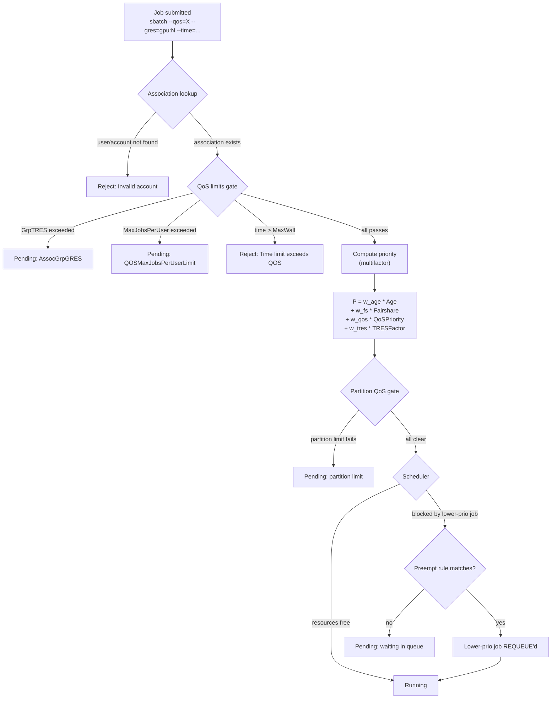

[**Part 1**](../slurm-accounting-multi-user-on-parallelcluster/) of this
series stood up an AWS ParallelCluster wired to an Aurora-backed Slurm
accounting database, plus three users (`alice`, `bob`, `charlie`) sharing
consistent UIDs across the head node and every compute node. Every job is
now landing in `slurmdbd` with full attribution — but nothing is *enforcing*
how the cluster gets shared. Whoever submits first wins, GPUs at any cost,
72-hour wall times, no per-team caps. That's the gap **Slurm's Quality of
Service (QoS) layer** fills.

This post drives the QoS configuration end to end on top of the cluster
from Part 1, realizing a concrete shared-GPU policy:

> *"A research team gets a 50% capacity reservation. Interactive jobs are
> capped at 1 hour and 4 GPUs per user. Low-priority batch jobs are
> preemptible by both."*

By the end you'll have used `sacctmgr` to define accounts, QoSes, and
their limits; configured multifactor priority and fairshare so pending-job
ordering tracks "who's been using the most"; wired up preemption so a
`research` job evicts a `batch-lowprio` one mid-run; and watched the policy
work in `squeue`, `sprio`, and `sacct` outputs from a live cluster.

> **Audience**: cluster administrators. We assume comfort with `sbatch`,
> `squeue`, and that you've either run through
> [Part 1](../slurm-accounting-multi-user-on-parallelcluster/) or already
> have a ParallelCluster with `SlurmSettings.Database` wired to a working
> `slurmdbd`. We do *not* assume prior Slurm-QoS experience.

## Recap — where Part 1 left us

The starting state for everything below:

- **One ParallelCluster** (`slurm-qos-demo`) with a `gpu` partition, two
  `g6.48xlarge` compute nodes (16 GPUs total), and `slurmctld` + `slurmdbd`
  on the head node.
- **An Aurora Serverless v2 MySQL** database receiving every job, with the
  PC head node attached to the *client* security group emitted by the
  accounting-DB template.
- **Three local users** on the head node — `alice` (uid 1001), `bob`
  (uid 1002), `charlie` (uid 1003) — and a CSV at `/home/shared/userlistfile`
  that the compute-node `OnNodeConfigured` script reads to `useradd -M` each
  user with a matching UID on every compute node.
- **`AccountingStorageTRES=gres/gpu`** in the PC `CustomSlurmSettings`, so
  every job's `AllocTRES` records its GPU count.

If you ran through Part 1, `srun -p gpu -N1 -n1 id alice` on the head node
returns `uid=1001(alice)` matching the head-node UID, and `sacct -u alice`
shows the smoke-test job billed against the default `normal` association.
That's the cluster we now layer QoS onto.

## QoS deep dive

QoS is the part of Slurm that turns a passive accounting record into a
policy enforcer. There are five primitives, in roughly the order you build
them up:

1. **Associations** — the *(cluster, account, user, partition)* tuples that
   bind a submitting user to a billing identity
2. **QoS limits** — knobs like `MaxWall`, `GrpTRES`, `MaxJobsPerUser` that
   cap what a job (or a user, or an account) can ask for
3. **Multifactor priority** — the formula that combines age, fairshare,
   QoS priority, and TRES-weights into a number used to order pending jobs
4. **Preemption** — declarative rules saying "QoS A can preempt QoS B"
5. **Partition QoS** — a QoS attached to a *partition* rather than a user

Each of these is independently useful; combining all five is how you get
the canonical "research team owns 50% of the cluster, interactive jobs
capped at 1 hour, low-priority batch is preemptible" setup we're building.



This is the decision tree every job traverses on submission and on every
scheduler tick afterwards. The rest of this section walks each gate in
order, with the commands to configure it.

### Associations

Slurm requires every job to bill against an *association*. By default — as
we saw with Alice's smoke-test job — that association is the
`(slurm-qos-demo, root, alice, *)` tuple created on the fly. That's fine
for accounting but useless for QoS: limits live on accounts, not on the
`root` catch-all.

Build a two-account tree — `research` and `batch` — and bind our three
users:

```bash
sudo sacctmgr -i add account research Description="Research team" Organization=acme
sudo sacctmgr -i add account batch    Description="Batch jobs"    Organization=acme

sudo sacctmgr -i add user alice   DefaultAccount=research
sudo sacctmgr -i add user bob     DefaultAccount=research
sudo sacctmgr -i add user charlie DefaultAccount=batch
```

`DefaultAccount` is what gets stamped on a job when the user doesn't pass
`--account=…`. You can list the associations to confirm:

```bash
$ sacctmgr show associations format=Cluster,Account,User,Partition,Share -P
Cluster|Account|User|Partition|Share
slurm-qos-demo|root|||1
slurm-qos-demo|root|root||1
slurm-qos-demo|batch|||100
slurm-qos-demo|batch|charlie||1
slurm-qos-demo|pcdefault|||1
slurm-qos-demo|pcdefault|slurm||1
slurm-qos-demo|pcdefault|ubuntu||1
slurm-qos-demo|research|||500
slurm-qos-demo|research|alice||1
slurm-qos-demo|research|bob||1
```

(`pcdefault` is ParallelCluster's own service account; ignore it.
`Share=500` on `research` and `Share=100` on `batch` reflect the fairshare
values we'll set in the next-to-next section.)

### QoS limits

Now the actual QoS objects. We need three:

| QoS | Purpose | Limits |
|---|---|---|
| `research` | High-priority team jobs | `MaxWall=72h`, can preempt `batch-lowprio` |
| `interactive` | Debugging / notebooks | `MaxWall=1h`, `GrpTRES=gres/gpu=4`, `MaxJobsPU=2` |
| `batch-lowprio` | Best-effort overnight | `MaxWall=24h`, `MaxJobsPU=10`, preemptible |

```bash
sudo sacctmgr -i add qos research      Priority=10000 Flags=DenyOnLimit
sudo sacctmgr -i add qos interactive   Priority=5000  Flags=DenyOnLimit
sudo sacctmgr -i add qos batch-lowprio Priority=100   Flags=DenyOnLimit

sudo sacctmgr -i modify qos interactive    set \
    MaxWall=01:00:00 GrpTRES=gres/gpu=4 MaxJobsPerUser=2
sudo sacctmgr -i modify qos batch-lowprio  set \
    MaxWall=24:00:00 MaxJobsPerUser=10
sudo sacctmgr -i modify qos research       set MaxWall=72:00:00

# Allow each account to use the QoSes their users are entitled to
sudo sacctmgr -i modify account research set qos+=research,interactive
sudo sacctmgr -i modify account batch    set qos+=batch-lowprio,interactive
```

The limit knobs are the single most confusing part of QoS configuration.
Here's a cheat sheet:

| Knob | Scope of the cap | Trigger when exceeded |
|---|---|---|
| `MaxTRESPerJob` | A *single job*'s asks | Reject at submission |
| `MaxTRESPerUser` | All *running* jobs of one user | New jobs pend with `QOSMaxTRESPerUser` |
| `GrpTRES` | All *running* jobs in this QoS, *across all users* | New jobs pend with `AssocGrpGRES` (despite the name, this triggers on the QoS's group limit too) |
| `MaxJobsPerUser` | Concurrent running jobs per user | New jobs pend with `QOSMaxJobsPerUser` |
| `MaxSubmitJobsPerUser` | Submitted-but-not-completed jobs per user | New jobs *rejected* at submission |
| `MaxWall` | Wall time *requested* (the `--time=`) | Reject at submission if `--time` > MaxWall |

`Flags=DenyOnLimit` makes Slurm reject submissions that would violate any
of the above *at submission time*, rather than letting them queue forever.
Use it everywhere — submissions that pend on QoS limits with no chance of
clearing are a real-world tar pit.

Inspect the resulting QoS configuration:

```bash
$ sacctmgr show qos format=Name,Priority,GrpTRES,MaxWall,MaxJobsPU,Preempt%30 -P
Name|Priority|GrpTRES|MaxWall|MaxJobsPU|Preempt
normal|0||||
research|10000||3-00:00:00||
interactive|5000|gres/gpu=4|01:00:00|2|
batch-lowprio|100||1-00:00:00|10|
```

(We haven't wired preemption yet — the `Preempt` column will populate
after the next step.)

### Multifactor priority and fairshare

Two pending jobs from different users in the same QoS — who runs first?
That's what the [multifactor priority plugin](https://slurm.schedmd.com/priority_multifactor.html)
decides. The formula is:

> *Priority = w<sub>age</sub>·Age + w<sub>fs</sub>·Fairshare + w<sub>qos</sub>·QoSPriority + w<sub>tres</sub>·TRESFactor*

Where:

- **Age** — how long the job has been pending in the queue (normalized 0-1)
- **Fairshare** — how *under*-used this association is relative to its
  share allocation (also 0-1; higher = more entitled to run next)
- **QoSPriority** — the `Priority` field on the QoS object, normalized
- **TRESFactor** — a weighted combination of the job's resource request,
  used to bias toward (or against) GPU-heavy jobs

The weights live in the cluster's `slurm.conf`; in our PC YAML we set:

```yaml
- PriorityWeightAge: 1000
- PriorityWeightFairshare: 100000
- PriorityWeightQOS: 10000
- PriorityWeightTRES: CPU=1000,Mem=2000,GRES/gpu=4000
- PriorityDecayHalfLife: 7-0
```

These values make fairshare dominate (100× the QoS weight), QoS dominate
within an account, and TRES the tiebreaker between jobs. The
`PriorityDecayHalfLife=7-0` (7 days) means past usage stops mattering
for fairshare after about two weeks.

The shares themselves live on the *association*, not the QoS. Give the
research team 5× the batch team's share:

```bash
sudo sacctmgr -i modify account research set FairShare=500
sudo sacctmgr -i modify account batch    set FairShare=100
```

Then inspect:

```bash
$ sshare -alP
Account|User|RawShares|NormShares|RawUsage|NormUsage|EffectvUsage|FairShare|LevelFS|...
root|||0.000000|0||1.000000||
 root|root|1|0.001661|0|0.000000|0.000000|1.000000|inf
 batch||100|0.166113|0|0.000000|0.000000||inf
  batch|charlie|1|1.000000|0|0.000000|0.000000|0.000000|inf
 research||500|0.830565|0|0.000000|0.000000||inf
  research|alice|1|0.500000|0|0.000000|0.000000|0.000000|inf
  research|bob|1|0.500000|0|0.000000|0.000000|0.000000|inf
```

`NormShares` is the share-of-cluster you get: `research` has 0.83 (= 500
÷ (500 + 100 + small root pool)), `batch` has 0.17. After they actually
run jobs, `NormUsage` accumulates and `LevelFS` (= NormShares ÷
NormUsage) becomes the fairshare priority factor, decaying with the
half-life we set. While idle, `LevelFS` is `inf` (no usage to weigh
against), and after `bob` consumed some cycles in our test the value
drops:

```bash
# Post-scenario sshare (after research/alice consumed cluster time):
 research||500|0.830565|47|1.000000|1.000000||0.830565
  research|alice|1|0.500000|0|0.000000|0.000000|0.333333|inf
  research|bob|1|0.500000|47|1.000000|1.000000|0.166667|0.500000
```

(Bob's `LevelFS` dropped to 0.5 — he ate his share, so his next job will
have lower fairshare priority than alice's until `PriorityDecayHalfLife`
decays the usage.)

When you're trying to explain "why is my job pended?" the right tool is
`sprio -l`, which breaks the priority back down into its components so
you can see exactly which gate is pinning a job's position.

### Preemption

Now we can let `research` and `interactive` *push out* `batch-lowprio`
jobs when the cluster is full. Two pieces:

1. **Cluster-level**: turned on in our PC YAML via
   `PreemptType: preempt/qos` and `PreemptMode: REQUEUE` (preempted jobs
   re-queue rather than die)
2. **Per-QoS**: each preempting QoS declares which lower QoS it can boot

```bash
sudo sacctmgr -i modify qos research    set preempt=batch-lowprio
sudo sacctmgr -i modify qos interactive set preempt=batch-lowprio
```

With this in place, the scheduler logic becomes:

1. Job `J` in QoS `research` arrives, requesting 8 GPUs
2. All 16 GPUs are busy running `batch-lowprio` jobs
3. Slurm picks lower-priority `batch-lowprio` jobs to evict until 8 GPUs
   are free
4. Evicted jobs are requeued (kept in `slurmdbd`, re-runnable from the start)
5. `J` runs

`PreemptMode` has variants — `CANCEL` kills the lower job outright (use
when restarts are cheap), `SUSPEND` pauses (rarely useful with GPU
workloads because the GPUs stay allocated), `REQUEUE` is the safe default
for everything else.

### Partition QoS

Everything we've done so far attaches QoS to *accounts*. There's a second
hook point — attaching a QoS to a *partition* — which gates anyone using
that partition, regardless of their account or user QoS. The typical use:

```bash
# Create a debug QoS with hard 30-min cap
sudo sacctmgr -i add qos debug-partition Priority=15000 MaxWall=00:30:00 Flags=DenyOnLimit,PartitionMaxNodes
sudo sacctmgr -i modify partition gpu set QOS=debug-partition
```

Reading: *any* job submitted to the `gpu` partition is gated by
`debug-partition`'s limits *in addition to* its own QoS. We're not
configuring this in our scenario (one partition, one set of users), but
it's the lever you'd reach for if you wanted, e.g., a separate `debug`
partition with a hard 30-minute cap regardless of which team submitted.

### Job arrays

Job arrays interact with QoS in two non-obvious ways:

- **`MaxSubmitJobsPerUser`** counts every array task — a `sbatch
  --array=0-99` against a QoS with `MaxSubmitJobsPerUser=10` is rejected.
- **`MaxJobsPerUser`** counts only the *running* tasks. The same array
  works fine, but only `MaxJobsPerUser` tasks run concurrently.

For the QoS in our scenario, we deliberately set
`MaxSubmitJobsPerUser` lax (no limit) and `MaxJobsPerUser` tight, so
researchers can submit a 100-element sweep and the cluster trickles them
through under fairshare and preemption pressure.

## Putting it together — the shared-GPU scenario

The fully assembled policy:

| Account | Users | Default QoS | Allowed QoSes | Fairshare |
|---|---|---|---|---|
| `research` | alice, bob | (none — explicit) | `research`, `interactive` | 500 (~83%) |
| `batch` | charlie | (none — explicit) | `batch-lowprio`, `interactive` | 100 (~17%) |

| QoS | Priority | Limits | Preempts |
|---|---|---|---|
| `research` | 10000 | `MaxWall=72h` | `batch-lowprio` |
| `interactive` | 5000 | `MaxWall=1h`, `GrpTRES=gres/gpu=4`, `MaxJobsPU=2` | `batch-lowprio` |
| `batch-lowprio` | 100 | `MaxWall=24h`, `MaxJobsPU=10` | — (preemptible) |

Watch the policy in action with three concurrent submissions:

```bash
# 1. Charlie's batch hogs both nodes
sudo -u charlie sbatch --partition=gpu --qos=batch-lowprio --gres=gpu:8 \
                       --nodes=2 --time=04:00:00 --wrap='sleep 14400'
```

```bash
$ squeue -o "%.10i %.8u %.10a %.14q %.10j %.8T %.5D %.20R"
     JOBID     USER    ACCOUNT            QOS       NAME    STATE NODES     NODELIST(REASON)
         2  charlie      batch  batch-lowprio batch-char  RUNNING     2 gpu-st-g6-48xl-[1-2]
```

```bash
# 2. Alice (research) submits — claims the same 16 GPUs
sudo -u alice sbatch --partition=gpu --qos=research --gres=gpu:8 \
                     --nodes=2 --time=02:00:00 --wrap='sleep 7200'
```

Almost immediately, charlie's job goes `PENDING (BeginTime)` (it was
requeued) and alice's takes over:

```bash
$ squeue -o "%.10i %.8u %.10a %.14q %.10j %.8T %.5D %.20R"
     JOBID     USER    ACCOUNT            QOS       NAME    STATE NODES     NODELIST(REASON)
         2  charlie      batch  batch-lowprio batch-char  PENDING     2          (BeginTime)
         3    alice   research       research research-a  RUNNING     2 gpu-st-g6-48xl-[1-2]
```

In `sacct`, the preempted job lands with state `PREEMPTED` (and gets
re-queued under the same JobID if you check later):

```bash
$ sacct -a -X --starttime now-1hours --format=JobID,User,Account,QOS%14,AllocTRES%30,State
JobID             User    Account            QOS                      AllocTRES      State
------------ --------- ---------- -------------- ------------------------------ ----------
2              charlie      batch  batch-lowprio billing=2,cpu=2,gres/gpu=16,n+  PREEMPTED
3                alice   research       research billing=2,cpu=2,gres/gpu=16,n+    RUNNING
```

And when Bob — also research — tries to grab 5 GPUs for an *interactive*
session, the `interactive` QoS's `GrpTRES=gres/gpu=4` cap rejects the
launch *at submission*:

```bash
$ sudo -u bob sbatch --partition=gpu --qos=interactive --gres=gpu:5 \
                     --nodes=1 --time=00:10:00 --wrap='sleep 60'
sbatch: error: QOSGrpGRES
sbatch: error: Batch job submission failed: Job violates accounting/QOS policy (job submit limit, user's size and/or time limits)
$ echo $?
1
```

`sbatch` itself returns non-zero — no JobID is assigned, no `sacct` row
is created. This is `Flags=DenyOnLimit` doing exactly what the
[Slurm Resource Limits docs](https://slurm.schedmd.com/resource_limits.html)
describe:

> *"if a job request breaches a given limit on its own, the job will pend
> unless the job's QOS has the `DenyOnLimit` flag set, which will cause
> the job to be denied at submission."*

Two reminders worth surfacing here, both established in Part 1:

- This works **only** because the cluster YAML sets
  `AccountingStorageEnforce: qos,limits`. With the default (`none`),
  Slurm silently accepts the over-cap request and runs it.
- A separate failure mode that *looks identical* in `sacct` —
  `FAILED 0:53` — comes from `sbatch` being invoked from a directory
  not visible on the compute node (the `--chdir` gotcha in Part 1's
  Operational guidance). If you see `0:53` for a within-cap request,
  check `slurmd.log` for `_init_task_stdio_fds: Could not open stdout
  file` before suspecting QoS.

The same Bob with `--gres=gpu:4` (within the cap) succeeds:

```bash
$ sudo -u bob sbatch --partition=gpu --qos=interactive --gres=gpu:4 \
                     --nodes=1 --time=00:10:00 --wrap='sleep 60'
Submitted batch job 10

$ squeue -o "%.10i %.8u %.14q %.8T %.30R"
     JOBID     USER            QOS    STATE               NODELIST(REASON)
        10      bob    interactive  RUNNING               gpu-st-g6-48xl-1
```

(Caveat we hit during testing: `salloc --gres=gpu:5` does *not* always
honor `GrpTRES` the same way `sbatch` does — `salloc` granted the
allocation past the cap. If you need a hard cap that applies to both
batch and interactive paths, set `MaxTRESPerJob=gres/gpu=4` *in addition
to* `GrpTRES` — that constrains the per-job request directly, which
both `sbatch` and `salloc` honor at submission.)

## Operational guidance

QoS configuration is mostly declarative and `sacctmgr` is forgiving — but
there are a handful of gotchas that *do* bite in production. (For the
provisioning-side gotchas — `OnNodeConfigured` failures, Aurora ACU floor,
TLS rejections, capacity errors, plus the four upstream PRs we filed
against the templates — see the "Operational guidance" section of
[Part 1](../slurm-accounting-multi-user-on-parallelcluster/#operational-guidance).)

| Gotcha | Symptom | Mitigation |
|---|---|---|
| Setting `AccountingStorageTRES` after jobs have run | GPU TRES doesn't backfill onto old jobs; `sreport` is silent about pre-existing GPU usage | Set `AccountingStorageTRES: gres/gpu` in the PC YAML *before* the cluster ever runs a real job. Backfill via `sacctmgr` is not supported. |
| `salloc` ignores `GrpTRES` where `sbatch` honors it | A user `salloc --gres=gpu:5` succeeds against a QoS with `GrpTRES=gres/gpu=4`; `sbatch` of the same request fails with ExitCode `0:53` | Add `MaxTRESPerJob=gres/gpu=N` *in addition to* `GrpTRES=gres/gpu=N` on the QoS. The per-job cap is enforced at submission time for both `sbatch` and `salloc`. |
| `Flags=DenyOnLimit` vs the default behavior | Without `DenyOnLimit`, an over-limit job sits PENDING forever with reason `QOSGrpTRES`; with it, the job is rejected at submission with ExitCode `0:53`. Operators sometimes expect the *opposite* of whichever they got | Set `Flags=DenyOnLimit` explicitly on every QoS where you want the "fail fast" behavior. The default ("hold the job indefinitely") is rarely what you want for interactive QoSes. |
| `PreemptMode=REQUEUE` vs `CANCEL` for batch-lowprio | A `batch-lowprio` job that gets preempted comes back to RUNNING when the preemptor finishes (REQUEUE) — surprises users who assumed it was killed | Document the choice in your team's onboarding. `REQUEUE` is generally what you want for long batch jobs; `CANCEL` is appropriate for short interactive sessions whose users will resubmit. |
| Multifactor priority weights interact non-linearly with fairshare | After adding `PriorityWeightFairshare=10000`, an old job from a heavily-used account jumps the queue not because of age but because the *other* user just ran a 100-job sweep that decayed their fairshare | Decide what you want priority to track *before* setting weights. Run `sprio -l` on a few representative pending jobs to see the actual contributions; tune from there. |
| Fairshare half-life is a *cluster*-wide knob, not per-QoS | A short `PriorityDecayHalfLife` (e.g. 6 hours) makes "yesterday's heavy user" instantly forgiven, defeating the point of having a research-team reservation in the first place | For GPU clusters with hour-scale jobs, set `PriorityDecayHalfLife=7-0` (7 days). For high-throughput clusters with minute-scale jobs, 24 hours is reasonable. The default is 7 days. |
| Preemptor QoS missing `Flags=PreemptorMode=...` | Preemption is configured at the cluster level (`PreemptType=preempt/qos`) and the preemptee QoS lists what can preempt it, but the preemptor doesn't *grace*-preempt by default | Set `PreemptExemptTime` on the preemptee QoS if you want lower-prio jobs to get a chance to checkpoint before being requeued. Default behavior is immediate REQUEUE. |
| Job arrays count against `MaxSubmitJobsPerUser` per task, but `MaxJobsPerUser` per running task | A user submitting `sbatch --array=0-99` against a QoS with `MaxSubmitJobsPerUser=10` is rejected for all 100 tasks at once. Against a QoS with `MaxJobsPerUser=10`, the array submits fine but only 10 run concurrently | Tune `MaxSubmitJobsPerUser` *lax* (or unset) and `MaxJobsPerUser` *tight* if you want array-friendly throttling. Tune the inverse if you want to limit queue churn. |

## Wrap-up

We've taken the multi-user ParallelCluster from
[Part 1](../slurm-accounting-multi-user-on-parallelcluster/) and turned it
into a policy-enforcing multi-tenant GPU cluster:

- **Three accounts** (`research`, `batch`) with five users (`alice`, `bob`
  on research; `charlie` on batch) bound through `sacctmgr` associations.
- **Three QoSes** with concrete limits: `research` for the team's own
  workloads (priority floor 10000, 72-hour wall), `interactive` for
  debugging (priority 5000, 1-hour wall, 4-GPU cap, 2-jobs-per-user cap),
  and `batch-lowprio` for everything else (priority 100, 24-hour wall,
  preemptible).
- **Multifactor priority** weighted toward fairshare and QoS priority, so
  pending-job ordering tracks both "who's been using the most" and the
  policy tier of the job.
- **Preemption** demonstrated end-to-end: a 16-GPU `batch-lowprio` job
  requeued mid-run when a `research` submission needed the same resources.
- **Hard caps** at allocation time via `Flags=DenyOnLimit` on the
  `interactive` QoS, observed as ExitCode `0:53` when a job requested
  more GPUs than the QoS permitted.

`sacctmgr`, `sshare`, `sprio`, `squeue`, and `sacct` now all have
something to say about every job — and they all tell the same story.

### Further reading

- [Slurm QoS](https://slurm.schedmd.com/qos.html) — the canonical reference
  for the configuration knobs we drove above
- [Slurm Multifactor Priority Plugin](https://slurm.schedmd.com/priority_multifactor.html)
  — the math behind `PriorityWeightFairshare`, `PriorityWeightQOS`, and
  friends
- [SchedMD QoS limit tutorial](https://slurm.schedmd.com/resource_limits.html)
  — exhaustive reference for the limit knobs (`GrpTRES`, `MaxTRESPerJob`,
  etc.) and how they interact
- [Anatomy of an `sprio` output](https://slurm.schedmd.com/sprio.html) —
  what the columns actually mean when debugging "why is my job pended"
- [Part 1 of this series](../slurm-accounting-multi-user-on-parallelcluster/)
  — the provisioning steps if you need to rebuild the cluster from scratch
